# 🚀 Week 9 — Enterprise AI Platform


---

## 📖 Overview

Week 9 marks the transition from individual AI workflows into a **modular enterprise AI platform**.

Instead of executing a single workflow, the platform introduces an **Enterprise Planner** capable of analysing user requests, selecting the correct workflow, dynamically loading it, and executing it through a shared routing layer.

This architecture closely resembles how enterprise AI platforms orchestrate specialised agents and services in production environments.

---

## 🎯 Objectives

The objectives of Week 9 were:

- Build a modular Enterprise AI Platform
- Separate planning from execution
- Dynamically load workflows
- Introduce an Enterprise Workflow Registry
- Build reusable router services
- Share workflow state
- Add Docker support
- Introduce automated testing
- Create production-ready documentation

---

## ✨ Features

- 🧠 Enterprise Planner
- 🔀 Dynamic Workflow Routing
- 📦 Workflow Registry
- 👋 Greeting Workflow
- ➗ Calculator Workflow
- 📚 Knowledge Workflow
- 🌍 Translation Workflow
- 🧠 Memory Workflow
- 🐳 Docker Support
- ✅ Pytest Test Suite
- 🏗 Modular Enterprise Architecture

---

## 🏢 Enterprise Architecture

The complete architecture documentation is available here:

➡️ **[View Enterprise Architecture](docs/architecture.md)**

The architecture documentation includes the Mermaid enterprise workflow diagram together with a detailed explanation of how the platform operates.

---

## 📂 Project Structure

```text
week9-enterprise-platform/
│
├── app.py
├── Dockerfile
├── requirements.txt
├── pytest.ini
├── README.md
│
├── config/
│   ├── settings.py
│   └── __init__.py
│
├── docs/
│   └── architecture.md
│
├── graphs/
│   ├── greeting_graph.py
│   ├── calculator_graph.py
│   ├── knowledge_graph.py
│   ├── translation_graph.py
│   ├── memory_graph.py
│   └── __init__.py
│
├── models/
│   ├── workflow_state.py
│   └── __init__.py
│
├── planner/
│   ├── enterprise_planner.py
│   └── __init__.py
│
├── registry/
│   ├── graph_loader.py
│   ├── workflow_registry.py
│   └── __init__.py
│
├── services/
│   ├── router_service.py
│   └── __init__.py
│
├── tests/
│   ├── test_registry.py
│   ├── test_router.py
│   └── __init__.py
│
└── screenshots/
    ├── 01-week9-enterprise-architecture-code.png
    ├── 02-week9-all-workflows-passing.png
    ├── 03-week9-independent-graphs-code.png
    ├── 04-week9-independent-graphs-success.png
    ├── 05-week9-dynamic-graph-loader.png
    ├── 06-week9-dynamic-loading-success.png
    ├── 07-week9-memory-workflow-code.png
    ├── 08-week9-memory-workflow-success.png
    ├── 09-week9-clean-platform-success.png
    ├── 10-week9-final-project-structure.png
    ├── 11-week9-enterprise-architecture-diagram.png
    └── 12-week9-docker-success.png
```

---

# 🛠 Technologies Used

| Technology | Purpose |
|------------|---------|
| Python 3.13 | Core development language |
| LangGraph | Enterprise workflow orchestration |
| LangChain | AI workflow foundation |
| Docker | Containerization |
| Pytest | Automated testing |
| VS Code | Development environment |
| Git & GitHub | Version control |
| Mermaid | Architecture documentation |

---

# ⚙️ Installation

Clone the repository:

```bash
git clone https://github.com/mnzirain/ai-engineer-journey.git
```

Navigate into Week 9:

```bash
cd ai-engineer-journey/week9-enterprise-platform
```

Install dependencies:

```bash
pip install -r requirements.txt
```

Run the application:

```bash
python app.py
```

---

# 🐳 Docker

Build the Docker image:

```bash
docker build -t week9-enterprise-platform .
```

Run the container:

```bash
docker run --rm week9-enterprise-platform
```

Docker successfully executes the entire enterprise platform inside an isolated container.

---

# ✅ Automated Testing

Execute the complete test suite:

```bash
pytest
```

Expected output:

```text
5 passed
```

The test suite validates:

- Workflow Registry
- Router Service
- Dynamic Workflow Loading
- Enterprise Routing
- Workflow Execution

---

# 📸 Project Screenshots

The following screenshots document the complete development journey of the Week 9 Enterprise AI Platform.

---

## 🏗 Enterprise Architecture

### Enterprise Platform Design

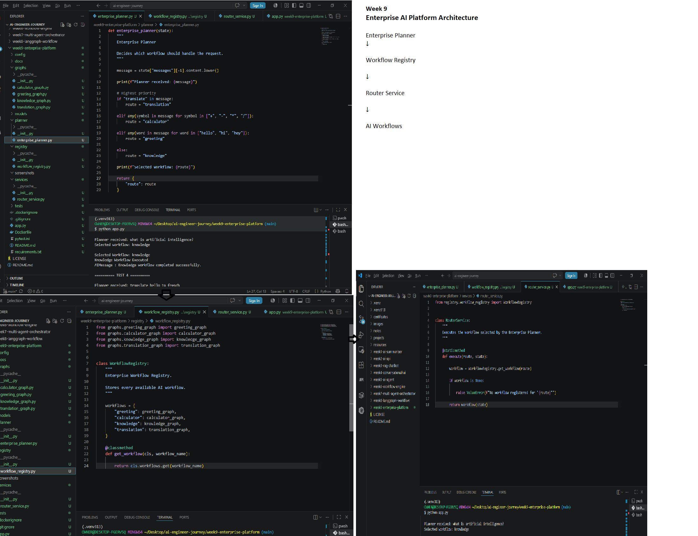

---

### Final Project Structure

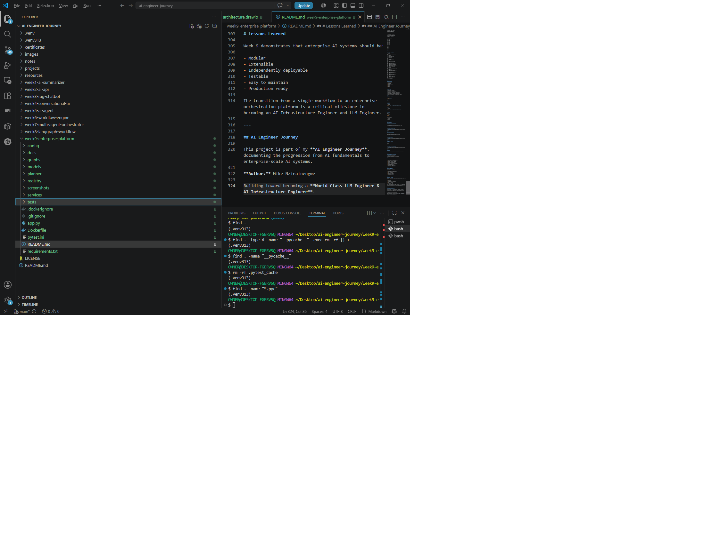

---

### Enterprise Architecture Diagram

The complete Mermaid architecture diagram can also be viewed in:

➡️ **[docs/architecture.md](docs/architecture.md)**

Reference screenshot:

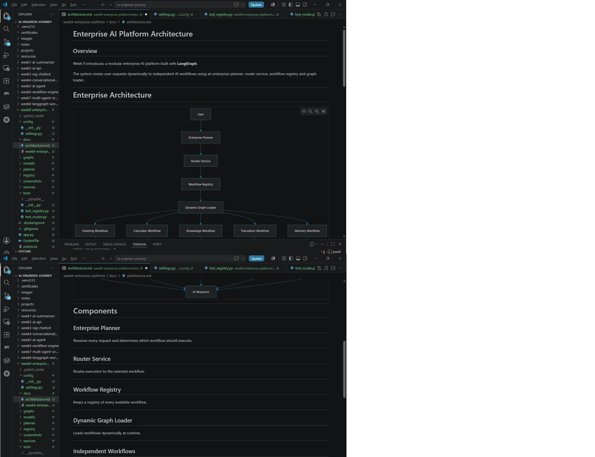

---

## 🔧 Workflow Development

### Enterprise Workflows Successfully Running

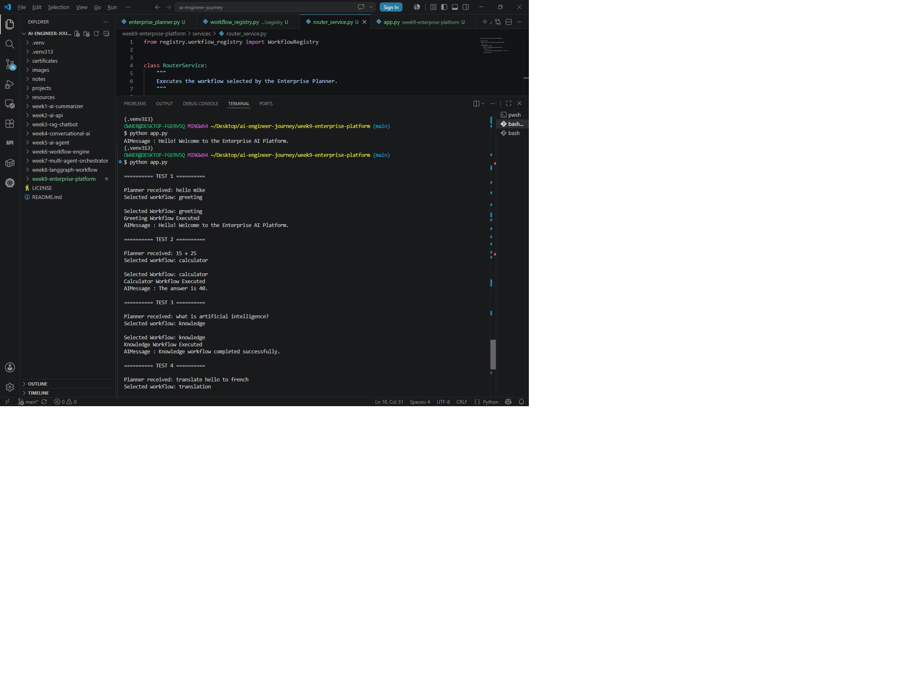

---

### Independent LangGraph Workflows

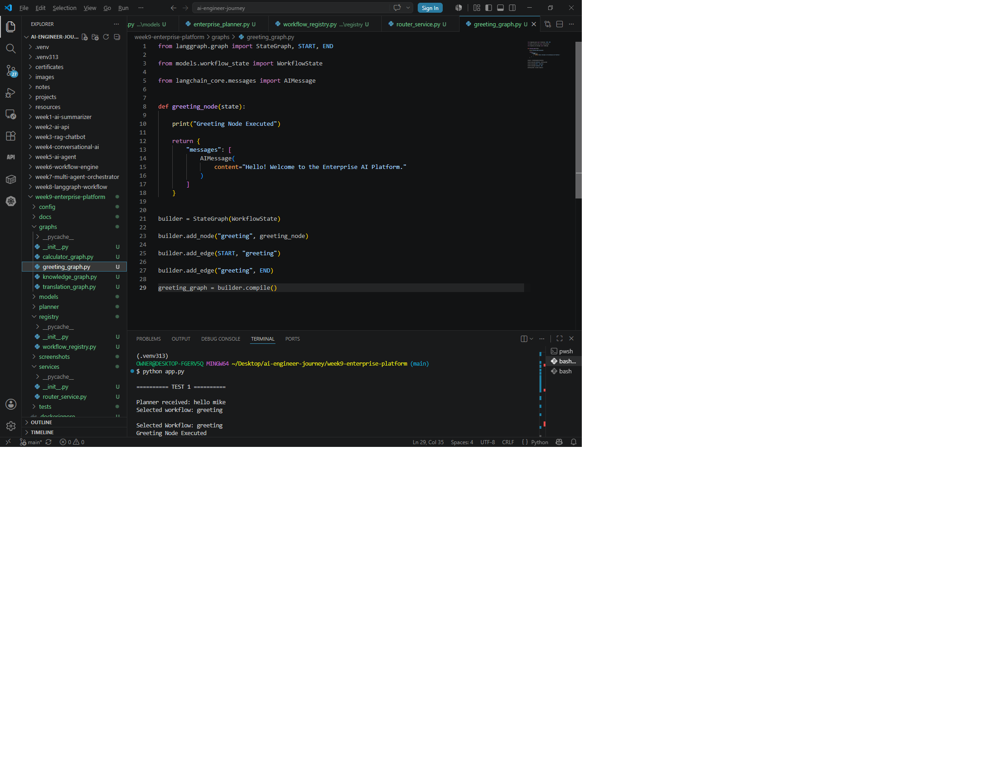

---

### Independent Graph Success

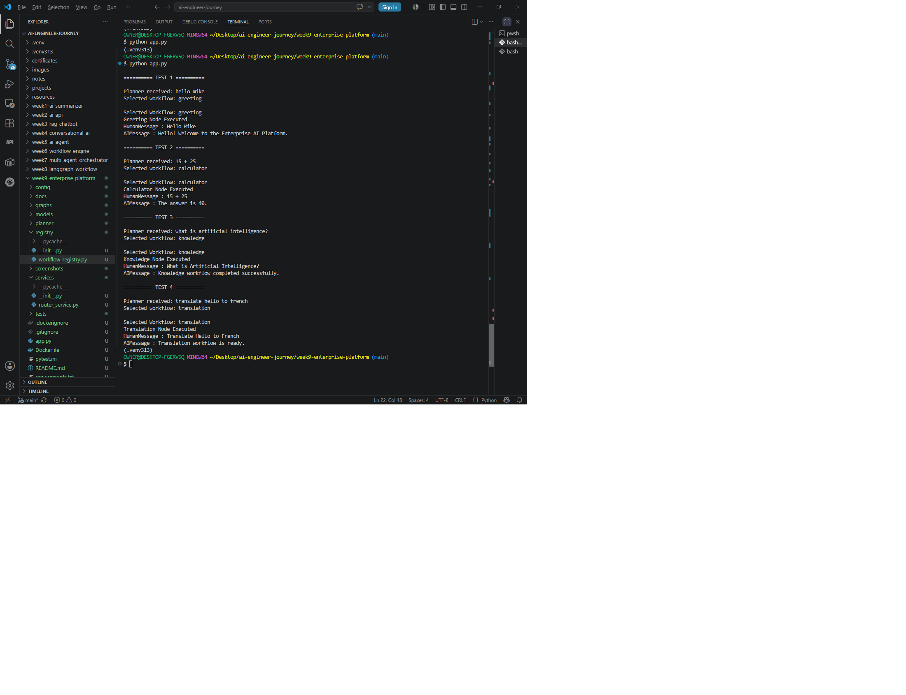

---

### Dynamic Graph Loader

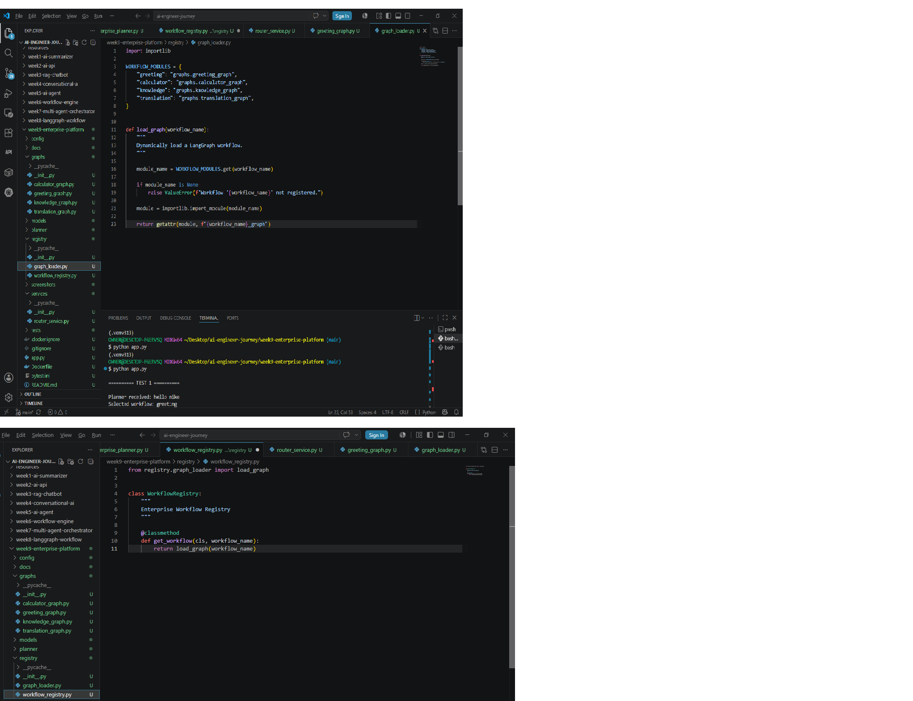

---

### Dynamic Loading Success

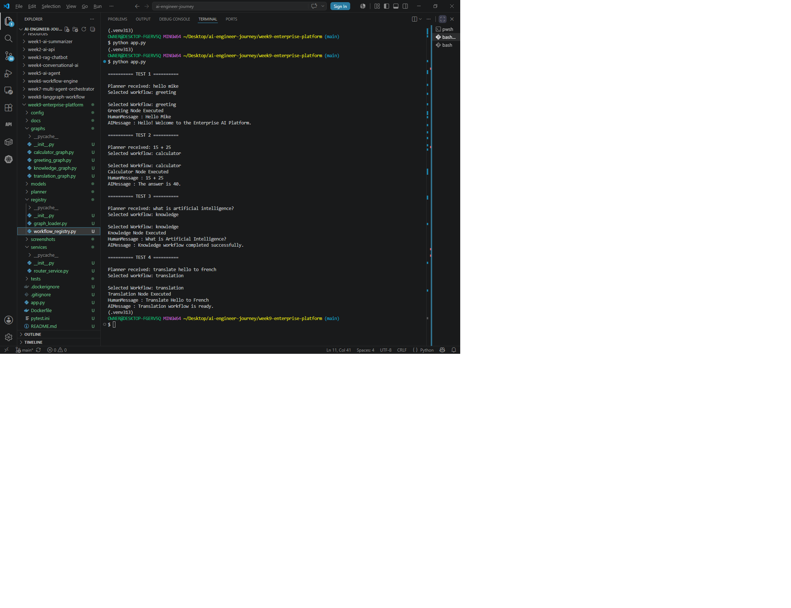

---

### Memory Workflow Implementation

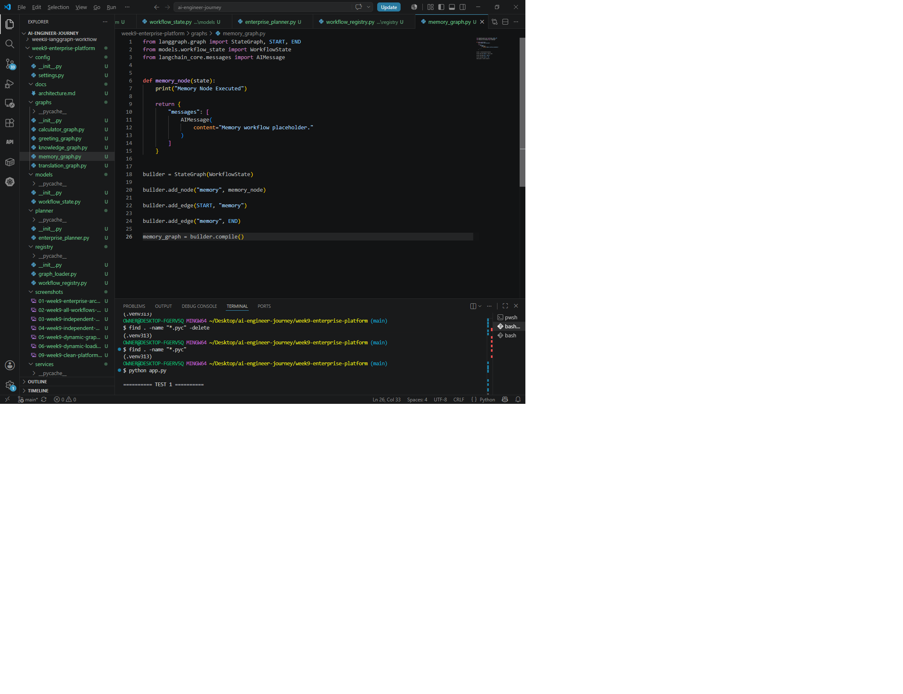

---

### Memory Workflow Execution

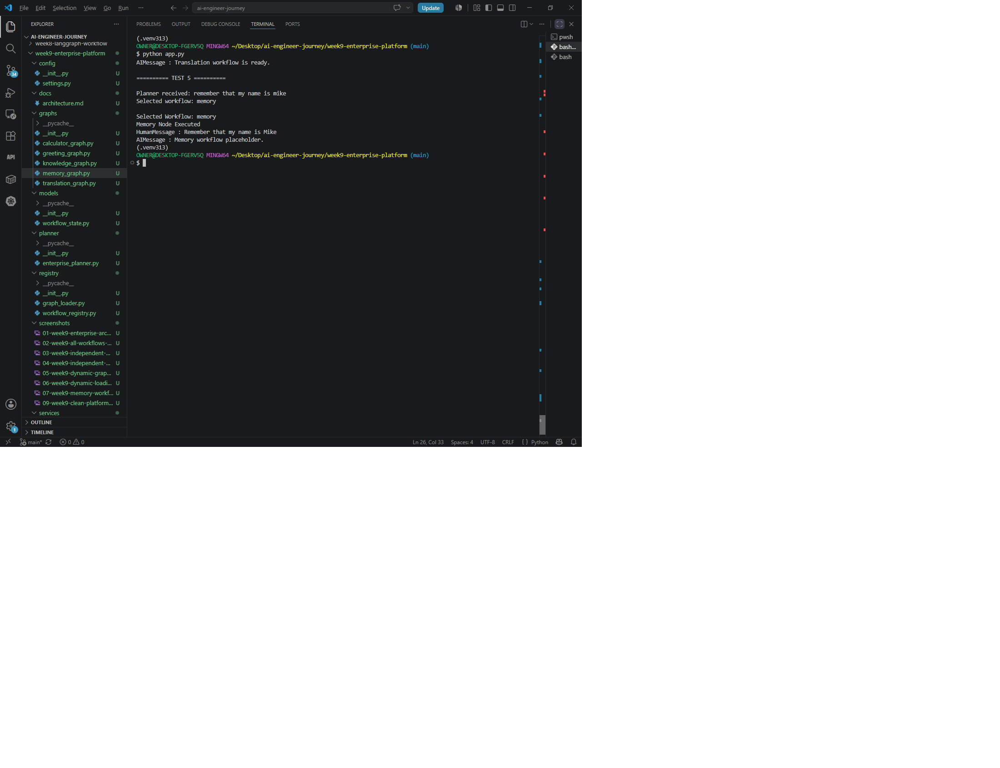

---

## ✅ Final Validation

### Enterprise Platform Final Execution

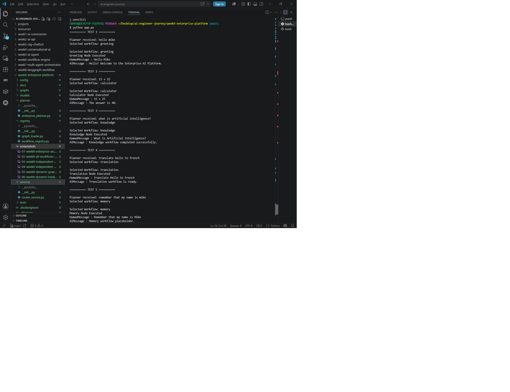

---

### Docker Validation

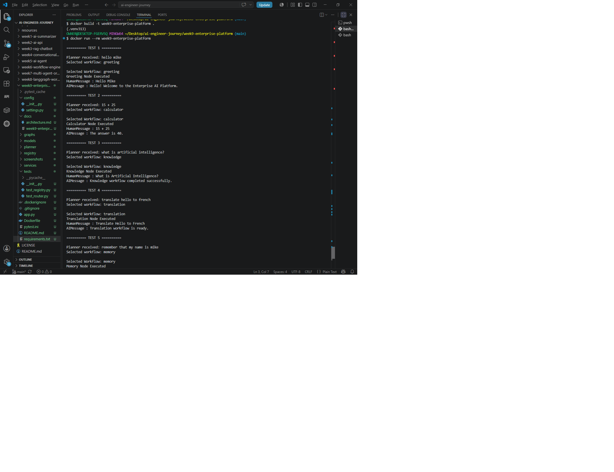

---

# 💡 Skills Demonstrated

Week 9 demonstrates the following enterprise AI engineering skills:

- Enterprise AI Architecture
- LangGraph Workflow Orchestration
- Dynamic Workflow Discovery
- Enterprise Planner Design
- Workflow Registry Pattern
- Shared Workflow State
- Router Service Pattern
- Modular Software Architecture
- Docker Containerisation
- Automated Testing with Pytest
- Enterprise Documentation
- Git Version Control

---

# 📚 Lessons Learned

This project reinforced several important software engineering principles:

- Separate planning from execution.
- Build reusable components instead of monolithic applications.
- Design workflows as independent modules.
- Use dynamic loading to simplify platform expansion.
- Write automated tests early.
- Document architecture as carefully as code.
- Build for maintainability rather than short-term convenience.

---

# 🚀 Future Improvements

Week 10 will expand this platform into a true enterprise multi-agent system by introducing:

- Supervisor Agent
- Specialist AI Agents
- Agent-to-Agent Communication
- Shared Long-Term Memory
- Task Delegation
- Parallel Workflow Execution
- Production API Integration

---

# 🎯 AI Engineer Journey

This project forms part of my structured AI Engineering portfolio.

Completed milestones:

- ✅ Week 1 — AI Summarizer
- ✅ Week 2 — FastAPI AI API
- ✅ Week 3 — Dockerized AI API
- ✅ Week 4 — Hugging Face Integration
- ✅ Week 5 — Retrieval-Augmented Generation Foundations
- ✅ Week 6 — Vector Database Integration
- ✅ Week 7 — Enterprise AI Foundations
- ✅ Week 8 — Enterprise LangGraph Workflow
- ✅ Week 9 — Enterprise AI Platform

---

# 👨‍💻 Author

**Mike Nzirainengwe**

AI Engineer Journey

Building production-ready AI systems with:

- Large Language Models (LLMs)
- LangGraph
- LangChain
- Docker
- FastAPI
- Enterprise AI Architecture
- AI Infrastructure Engineering

GitHub:

https://github.com/mnzirain

---

⭐ If you found this project interesting, feel free to explore the rest of my AI Engineer Journey repository.