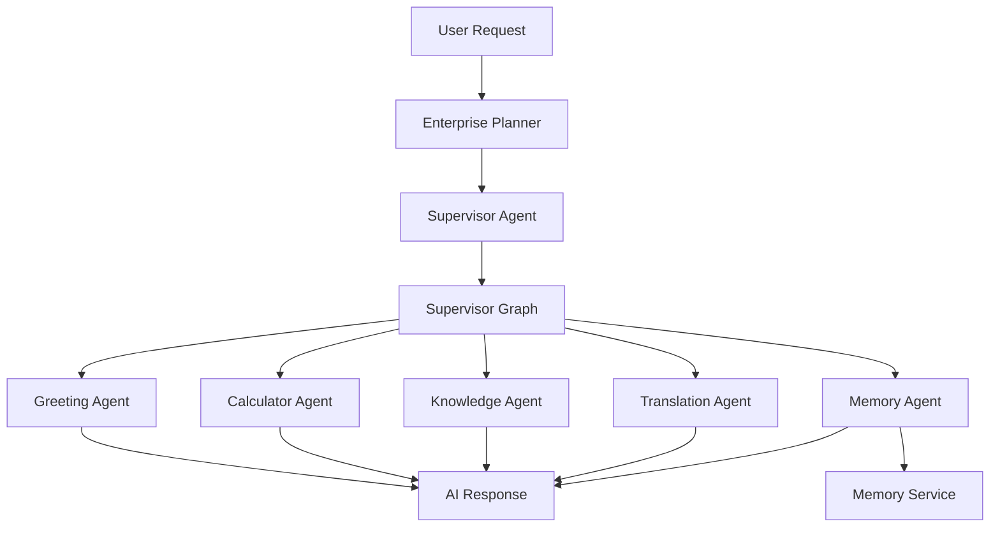
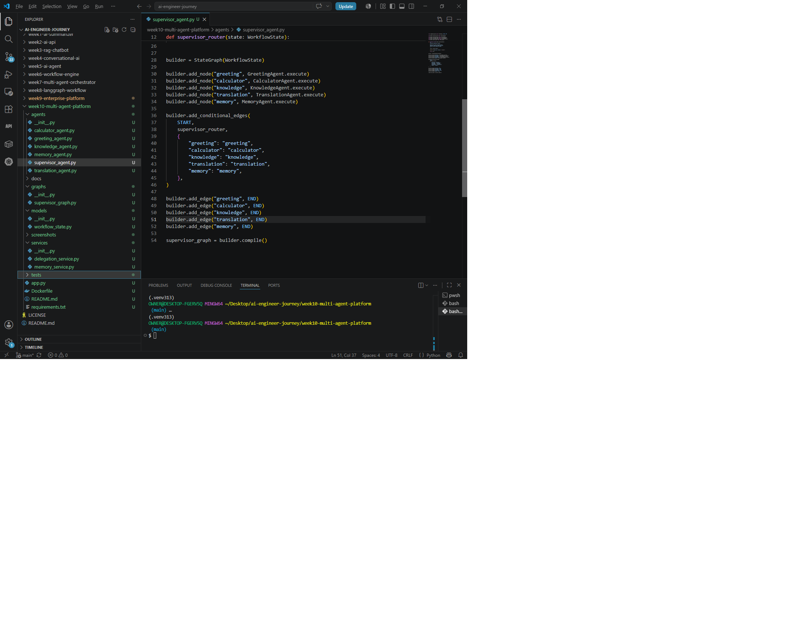
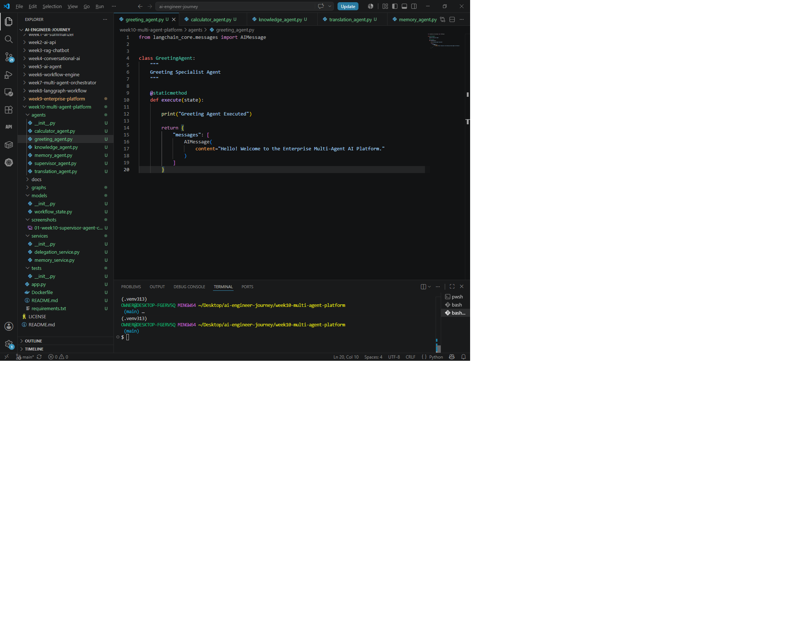
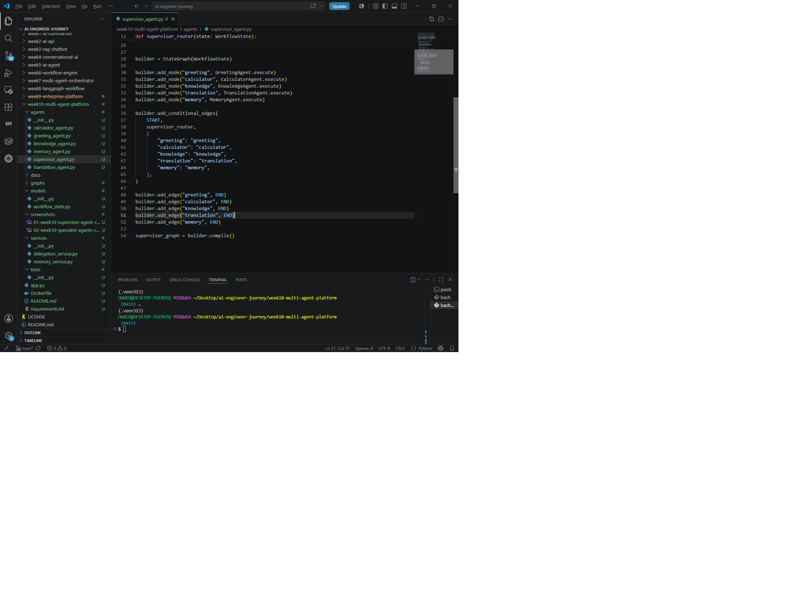
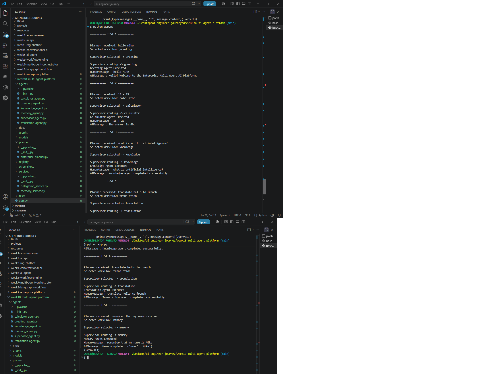
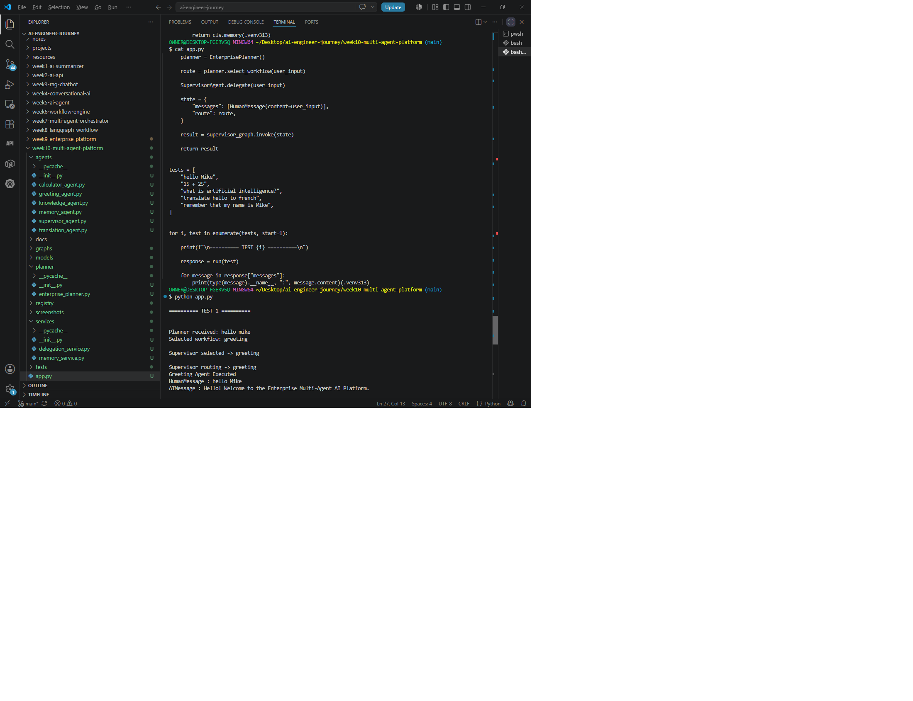
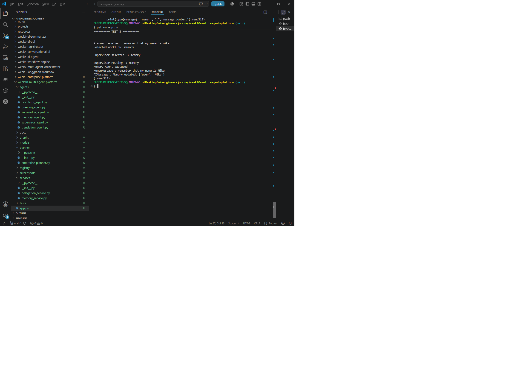
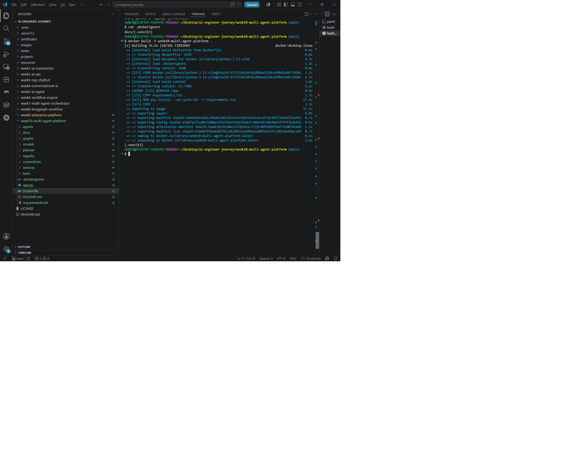
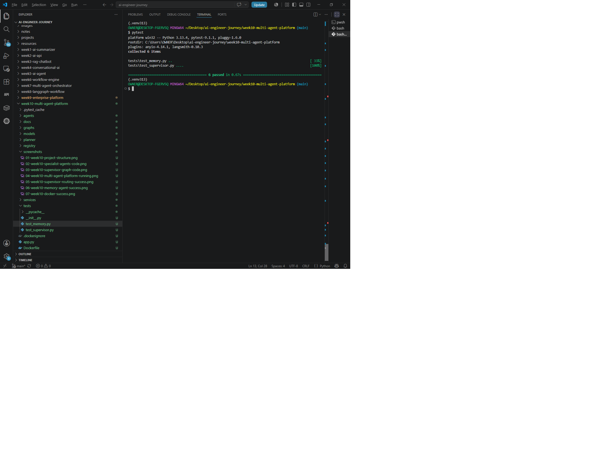

# 🚀 Week 10 – Enterprise Multi-Agent AI Platform


---

# 📌 Project Overview

Week 10 extends the Enterprise AI Platform developed in Week 9 into a **true Multi-Agent AI System**.

Instead of executing workflows directly, the platform now introduces a **Supervisor Agent** responsible for coordinating multiple specialist AI agents.

Each specialist agent is responsible for a single business capability while the Supervisor Agent orchestrates execution based on the user's intent.

This architecture follows enterprise software engineering principles including:

- Separation of concerns
- Modular AI architecture
- Shared application state
- Agent delegation
- Scalable orchestration
- Extensible workflow design

The result is a platform that closely resembles how production-grade enterprise AI systems are structured.

---

# 🎯 Project Objectives

The goals of this project were to:

- Build an Enterprise Multi-Agent architecture
- Introduce Supervisor-based orchestration
- Separate business capabilities into independent AI agents
- Demonstrate shared memory between agents
- Build a scalable enterprise architecture
- Prepare the platform for future RAG, tool use, databases, and autonomous planning

---

# ✨ Key Features

## 🧠 Enterprise Planner

Determines the user's intent and selects the appropriate workflow.

---

## 👨‍💼 Supervisor Agent

Acts as the orchestration layer responsible for delegating work to specialist agents.

---

## 🤖 Specialist AI Agents

The platform currently contains five independent agents:

- 👋 Greeting Agent
- ➗ Calculator Agent
- 📚 Knowledge Agent
- 🌍 Translation Agent
- 🧠 Memory Agent

Each agent is responsible for only one domain.

---

## 🗂 Shared Memory

The Memory Agent demonstrates shared application state by storing and retrieving user information through a centralized Memory Service.

---

## 🔀 LangGraph Orchestration

The Supervisor Graph dynamically routes requests to the correct specialist agent while maintaining a shared workflow state.

---

## 🐳 Docker Support

The application is fully containerized and can be executed consistently across environments.

---

## ✅ Automated Testing

Pytest is used to validate:

- Planner routing
- Workflow registry
- Supervisor routing
- Memory service
- Enterprise components

---

# 🏗 Enterprise Multi-Agent Architecture



The architecture follows an enterprise orchestration model where the **Enterprise Planner** identifies user intent, the **Supervisor Agent** coordinates execution, and the **Supervisor Graph** routes requests to independent specialist agents. This modular design makes it easy to add new capabilities without modifying existing agents.

---

# 📂 Project Structure

```text
week10-multi-agent-platform/

├── agents/
│   ├── greeting_agent.py
│   ├── calculator_agent.py
│   ├── knowledge_agent.py
│   ├── translation_agent.py
│   ├── memory_agent.py
│   └── supervisor_agent.py
│
├── graphs/
│   └── supervisor_graph.py
│
├── planner/
│   └── enterprise_planner.py
│
├── services/
│   ├── delegation_service.py
│   └── memory_service.py
│
├── registry/
│   └── workflow_registry.py
│
├── models/
│   └── workflow_state.py
│
├── config/
│   └── settings.py
│
├── tests/
│   ├── test_registry.py
│   ├── test_router.py
│   ├── test_supervisor.py
│   └── test_memory.py
│
├── docs/
│   ├── architecture.md
│   └── week10-multi-agent-platform-architecture.png
│
├── screenshots/
│
├── Dockerfile
├── .dockerignore
├── requirements.txt
└── app.py
```

---

# ⚙️ Technologies Used

| Category | Technologies |
|----------|--------------|
| Language | Python 3.13 |
| AI Framework | LangGraph |
| AI Components | LangChain Core |
| Architecture | Multi-Agent System |
| State Management | WorkflowState |
| Memory | Shared Memory Service |
| Routing | Enterprise Planner |
| Orchestration | Supervisor Graph |
| Testing | Pytest |
| Containerization | Docker |
| Documentation | Mermaid Diagrams + Markdown |

---

# 🧩 System Components

### Enterprise Planner

Determines the user's intent and selects the appropriate workflow.

---

### Supervisor Agent

Coordinates execution by delegating tasks to specialist agents.

---

### Supervisor Graph

Routes requests dynamically using LangGraph conditional edges.

---

### Specialist Agents

Each specialist focuses on a single business capability:

- Greeting
- Calculator
- Knowledge
- Translation
- Memory

---

### Memory Service

Provides shared application state that can be accessed across multiple agents, preparing the platform for future long-term conversational memory and enterprise storage backends.

---

# 🐳 Running with Docker

Build the image:

```bash
docker build -t week10-multi-agent-platform .
```

Run the container:

```bash
docker run week10-multi-agent-platform
```

The Docker image provides a reproducible environment for running the Enterprise Multi-Agent AI Platform.

---

# 🧪 Running the Test Suite

Execute all automated tests:

```bash
pytest
```

The project includes automated tests covering:

- Enterprise Planner routing
- Workflow Registry
- Supervisor routing
- Memory Service
- Multi-agent platform components

All tests pass successfully.

---

# 📸 Project Screenshots

## Project Structure



---

## Specialist Agents



---

## Supervisor Graph



---

## Multi-Agent Platform Running



---

## Supervisor Routing



---

## Shared Memory



---

## Docker Build



---

## Automated Tests



---

# 💼 Skills Demonstrated

This project demonstrates practical experience with:

- Enterprise AI Architecture
- Multi-Agent Systems
- LangGraph StateGraph
- LangChain Core
- Supervisor-Based Orchestration
- Dynamic Workflow Delegation
- Shared Application State
- Enterprise Routing
- Docker Containerization
- Automated Testing with Pytest
- Modular Software Engineering
- Documentation & System Design

---

# 🚀 Future Roadmap

Future iterations of this platform will include:

- Retrieval-Augmented Generation (RAG)
- Vector Databases
- Redis Memory
- PostgreSQL Integration
- Long-Term Conversational Memory
- Tool Calling
- Autonomous Planning
- Human-in-the-Loop Approval
- Agent Collaboration
- Observability & Monitoring
- Kubernetes Deployment
- Production API Gateway
- Enterprise Authentication

---

# 📚 Lessons Learned

Week 10 introduced a significant architectural improvement over Week 9.

Key lessons include:

- Separating orchestration from execution simplifies maintenance.
- Specialist agents are easier to extend than monolithic workflows.
- Shared state enables collaboration between agents.
- LangGraph provides a clean framework for enterprise orchestration.
- Containerization improves portability and deployment consistency.
- Automated testing increases confidence when expanding the platform.

---

# 👨‍💻 Author

**Mike Nzirainengwe**

### AI Engineer | LLM Engineer | Multi-Agent AI Systems Builder

Building production-ready Enterprise AI Systems, Multi-Agent Platforms, LLM Infrastructure, and AI Architecture one week at a time.

**Current Focus**

- Enterprise AI Architecture
- Multi-Agent Systems
- Large Language Models (LLMs)
- AI Infrastructure Engineering
- LangGraph & LangChain
- Production AI Platforms