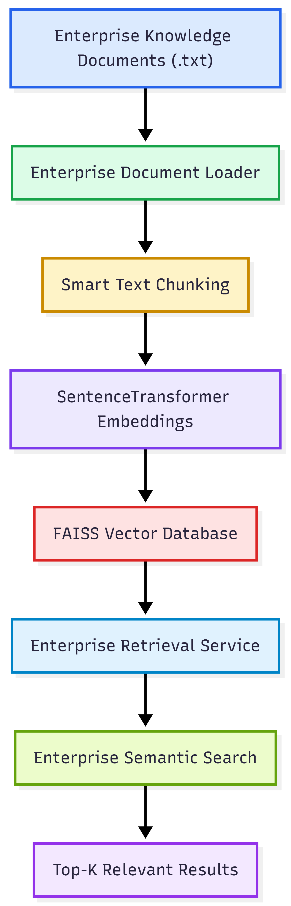

# Week 12 – Enterprise Vector Databases & Semantic Search Architecture

## Overview

This project demonstrates the architecture of an Enterprise Semantic Search Platform.

Instead of relying on traditional keyword search, the platform performs semantic retrieval using vector embeddings stored in a FAISS vector database.

This architecture forms the foundation of modern Retrieval-Augmented Generation (RAG) systems.

---

# Architecture Diagram

The architecture diagram is available below:



---

# Enterprise Workflow

```text
Enterprise Documents
        │
        ▼
Document Loader
        │
        ▼
Smart Text Chunking
        │
        ▼
SentenceTransformer Embeddings
        │
        ▼
FAISS Vector Database
        │
        ▼
Enterprise Retrieval Service
        │
        ▼
Semantic Search Results
```

---

# Components

## Enterprise Document Loader

Loads enterprise knowledge documents from disk.

---

## Smart Chunking Service

Splits documents into retrieval-friendly chunks while preserving semantic meaning.

---

## Embedding Service

Uses SentenceTransformers to convert document chunks into dense vector embeddings.

---

## FAISS Vector Database

Stores embeddings and performs high-speed nearest-neighbour similarity search.

---

## Enterprise Retrieval Service

Searches the FAISS vector database and retrieves the most semantically relevant document chunks.

---

## Semantic Search

Returns contextual information based on meaning rather than exact keyword matching.

---

# Enterprise AI Concepts Demonstrated

- Semantic Search
- Vector Databases
- Sentence Embeddings
- Document Chunking
- FAISS Indexing
- Enterprise Retrieval Pipelines
- Retrieval-Augmented Generation (RAG) Foundations
- Production AI Architecture

---

# Future Enhancements

Future enterprise improvements include:

- Hybrid Search (BM25 + Vector Search)
- Metadata Filtering
- ChromaDB
- PostgreSQL pgvector
- Pinecone
- Weaviate
- Milvus
- Enterprise RAG APIs
- LLM-powered Answer Generation

---

# Summary

This architecture demonstrates the complete semantic retrieval pipeline used by enterprise Retrieval-Augmented Generation (RAG) systems.

By combining document ingestion, intelligent chunking, vector embeddings, FAISS indexing, and semantic retrieval, the platform provides the foundation for production-grade AI knowledge systems that can later be integrated with Large Language Models (LLMs) for intelligent question answering and enterprise AI assistants.

This project represents one of the core building blocks for future AI platforms such as MedNavi AI.