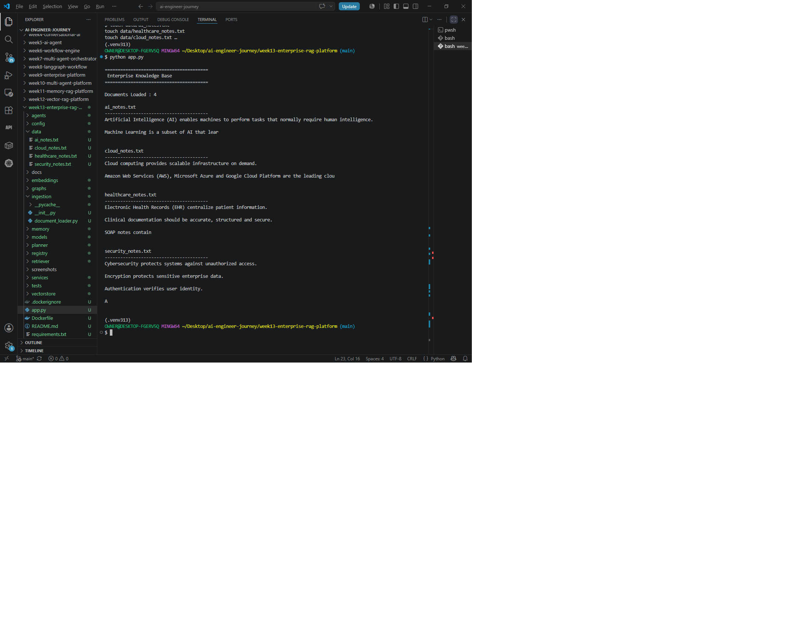
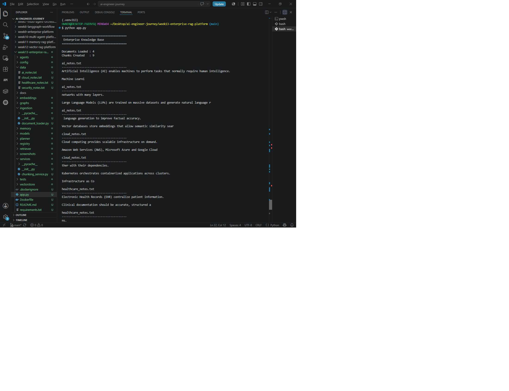
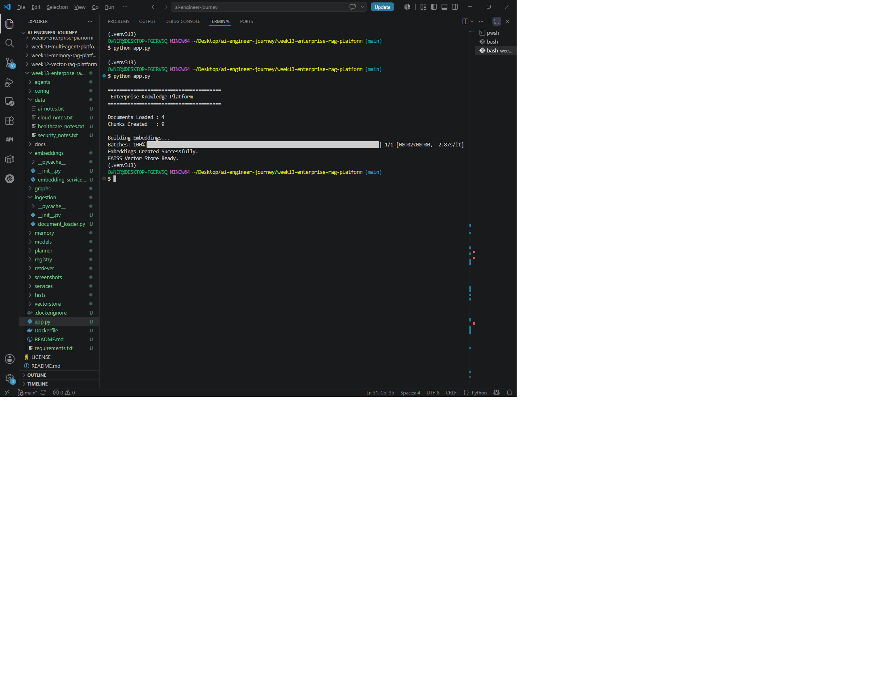
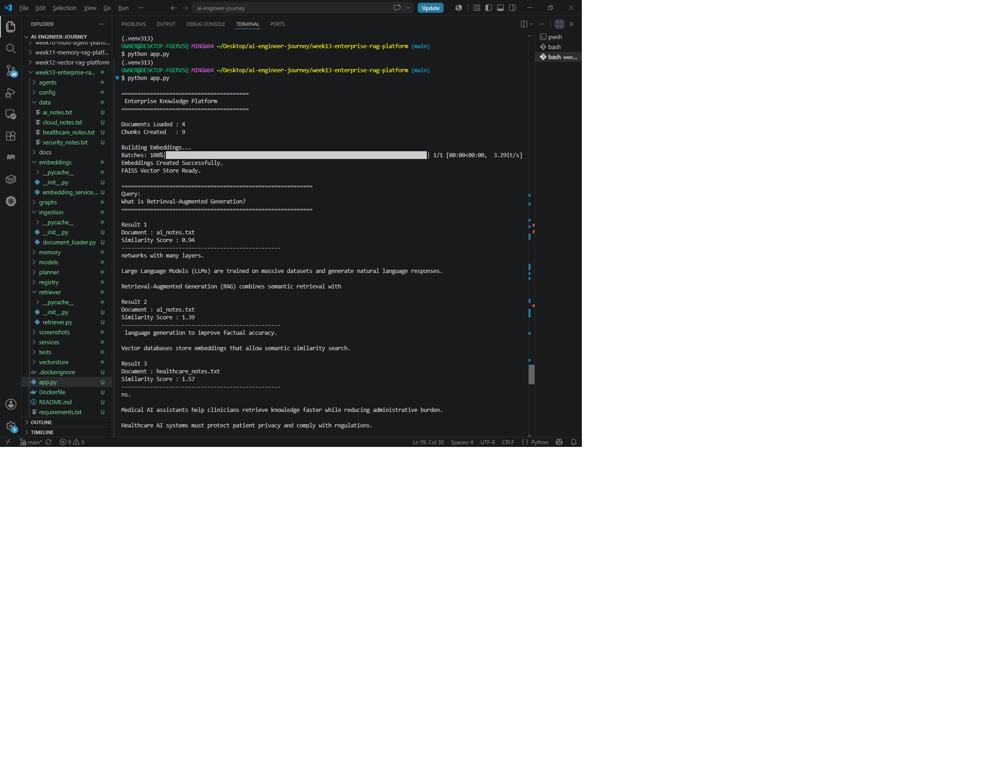
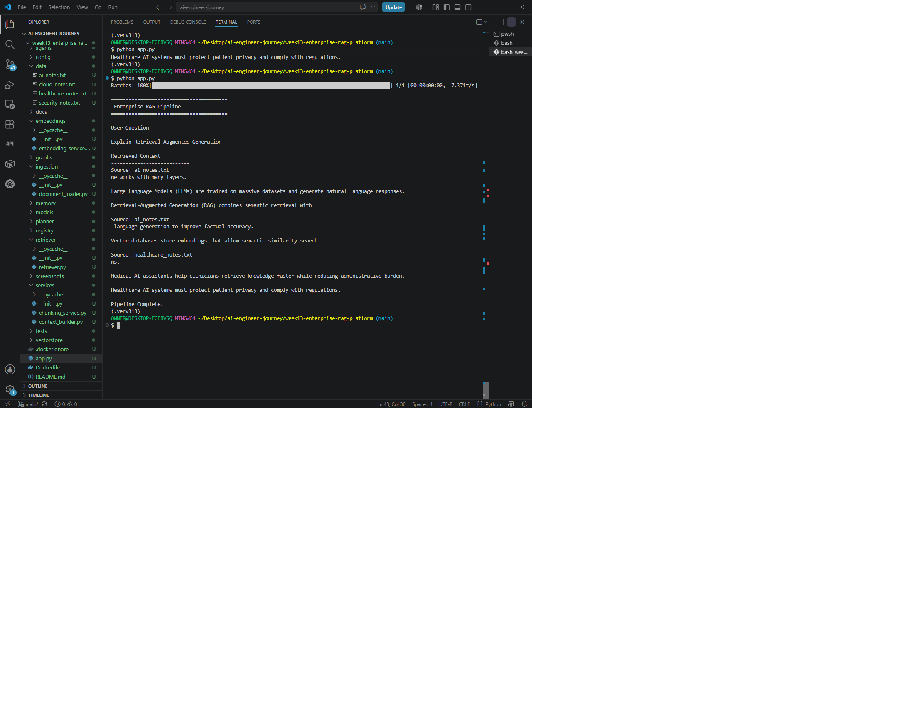
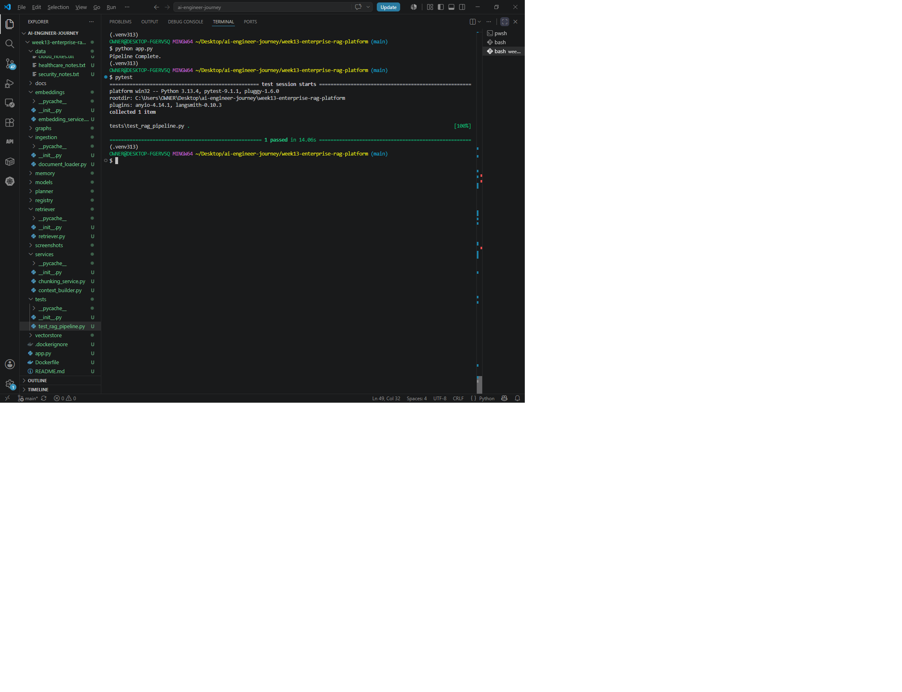
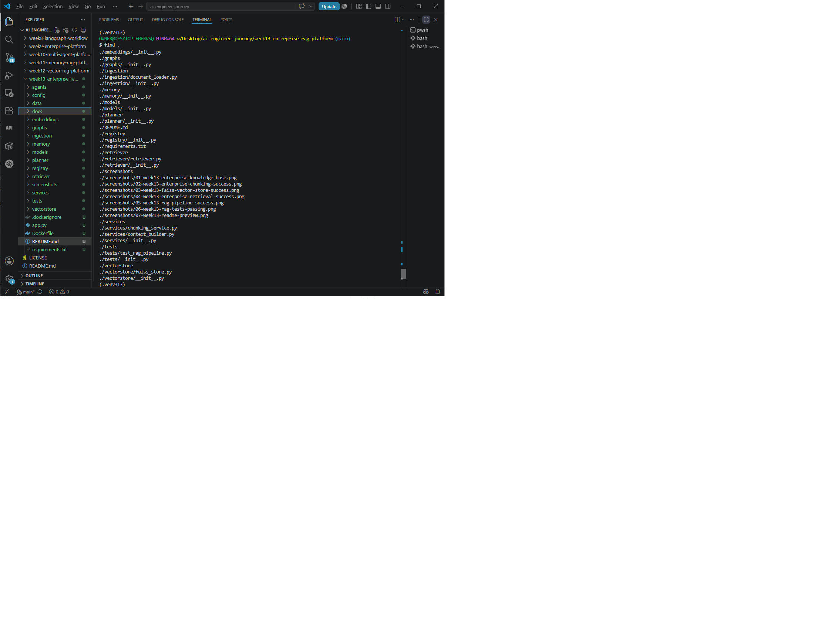
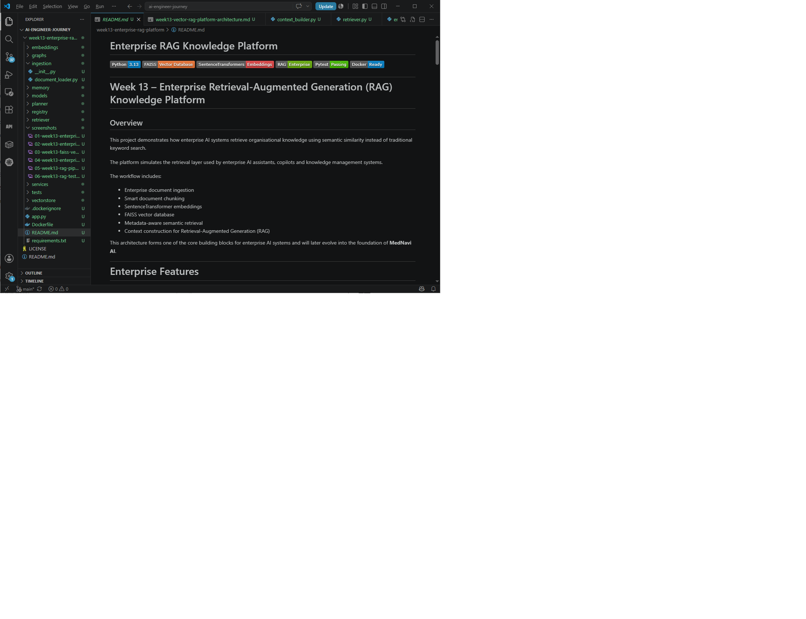

# Week 13 — Enterprise RAG Retrieval & Context Platform

> **Enterprise AI Infrastructure | Semantic Retrieval | FAISS Vector Search | RAG Context Construction**

---

## 🏛️ Project Overview

Week 13 introduces an **Enterprise RAG Retrieval & Context Platform** that demonstrates the retrieval and context-construction layer required by modern AI systems.

The project moves beyond simple LLM application development into **AI knowledge infrastructure** by implementing an end-to-end pipeline that:

* loads enterprise knowledge documents;
* divides documents into retrieval-ready chunks;
* generates semantic embeddings;
* builds a FAISS vector index;
* performs Top-K semantic retrieval;
* preserves source-document information;
* constructs contextual material for downstream RAG generation;
* validates the implemented retrieval and context-construction pipeline through automated testing.

The implementation is intentionally focused on the **retrieval foundation of a RAG system**. The current project retrieves and constructs context for a future LLM response rather than claiming to provide the final LLM-generated answer itself.

> **Scope clarification:** Week 13 is an enterprise-oriented RAG retrieval foundation and portfolio implementation. Production-scale capabilities such as authentication, access-controlled retrieval, observability, persistent vector infrastructure, hybrid search and LLM serving are identified as future evolution rather than claimed as completed features.

---

# 🎯 Engineering Objective

The objective of Week 13 is to demonstrate how enterprise AI systems can move from unstructured organisational documents to semantically retrievable knowledge.

The implemented architecture follows:

```text
Enterprise Documents
        │
        ▼
Document Loader
        │
        ▼
Document Chunking
        │
        ▼
SentenceTransformer Embeddings
        │
        ▼
FAISS Vector Index
        │
        ▼
Enterprise Retriever
        │
        ▼
Top-K Semantic Results
        │
        ▼
Context Builder
        │
        ▼
RAG Context
        │
        ▼
Future LLM Response
```

This establishes the retrieval layer between an enterprise knowledge base and a future AI reasoning or generation layer.

---

# 🧩 Core Capabilities

## 1. Enterprise Document Ingestion

The `EnterpriseDocumentLoader` reads `.txt` documents from the project's `data/` directory.

Each loaded document retains:

* its filename;
* its complete text content.

Current knowledge sources include:

```text
data/
├── ai_notes.txt
├── cloud_notes.txt
├── healthcare_notes.txt
└── security_notes.txt
```

This provides a simple foundation for building a domain-oriented enterprise knowledge base.

---

## 2. Document Chunking

The `ChunkingService` divides documents into smaller retrieval units.

The verified application configuration uses:

```text
chunk_size = 200
```

Each resulting chunk retains the source filename together with its text:

```text
{
    "filename": "...",
    "text": "..."
}
```

This allows retrieved context to remain associated with its originating document.

> **Implementation note:** The current chunking strategy is configurable fixed-size character chunking. It is not claimed as a semantic or sentence-aware chunking algorithm.

---

## 3. Semantic Embeddings

The platform uses **SentenceTransformers** with:

```text
sentence-transformers/all-MiniLM-L6-v2
```

Document chunks are converted into numerical vector representations.

The same embedding model is then used to convert a user query into a vector representation suitable for similarity search.

This creates the semantic retrieval layer that allows the system to retrieve conceptually related information rather than relying purely on keyword matching.

---

## 4. FAISS Vector Search

The project uses **FAISS** as its vector search engine.

The verified implementation creates:

```text
faiss.IndexFlatL2
```

The embedding vectors are converted to `float32` and inserted into the FAISS index.

The retriever then performs an L2-distance search against the query embedding.

This provides a concrete vector-search implementation rather than merely describing vector databases conceptually.

---

## 5. Top-K Semantic Retrieval

The `EnterpriseRetriever` performs semantic retrieval using the FAISS index.

The implemented default is:

```text
top_k = 3
```

The retriever returns structured results containing:

```text
filename
text
score
```

The score represents the FAISS L2 distance returned by the vector search.

The retrieved results therefore retain both the relevant text and its source-document identity.

---

# 🔄 End-to-End RAG Retrieval Pipeline

The main `app.py` connects the individual services into one executable pipeline.

The verified execution flow is:

```text
1. Load enterprise documents
            ↓
2. Chunk documents
            ↓
3. Generate embeddings
            ↓
4. Build FAISS index
            ↓
5. Create retriever
            ↓
6. Submit semantic query
            ↓
7. Retrieve Top-K chunks
            ↓
8. Build RAG context
            ↓
9. Display retrieved context
```

The current demonstration query is:

```text
Explain Retrieval-Augmented Generation
```

The pipeline prints:

```text
Enterprise RAG Pipeline

User Question
---------------------------
Explain Retrieval-Augmented Generation

Retrieved Context
---------------------------
...

Pipeline Complete.
```

The final stage is intentionally represented as **retrieved context**, providing the foundation for a future LLM generation layer.

---

# 🧠 Context Construction

The `ContextBuilder` converts retrieved results into a structured text context.

Each retrieved result is represented with its source:

```text
Source: ai_notes.txt
<retrieved text>
```

Multiple retrieved chunks are combined into a single context payload.

This creates the bridge between:

```text
Vector Retrieval
       ↓
Retrieved Knowledge
       ↓
RAG Context
       ↓
Future LLM Generation
```

The current implementation therefore demonstrates the **retrieval/context side of RAG**, while leaving final answer generation as a subsequent architectural layer.

---

# 🏗️ Enterprise Architecture

The architecture separates the major responsibilities into dedicated modules:

```text
                    Enterprise Knowledge Base
                              │
                              ▼
                    Document Loader
                              │
                              ▼
                    Chunking Service
                              │
                              ▼
                 SentenceTransformer Model
                              │
                              ▼
                       FAISS Vector Index
                              │
                              ▼
                    Enterprise Retriever
                              │
                         Top-K Results
                              │
                              ▼
                       Context Builder
                              │
                              ▼
                         RAG Context
                              │
                              ▼
                       Future LLM Layer
```

### Architectural Components

| Component                  | Responsibility                             |
| -------------------------- | ------------------------------------------ |
| `EnterpriseDocumentLoader` | Loads enterprise `.txt` documents          |
| `ChunkingService`          | Splits documents into retrieval chunks     |
| `EmbeddingService`         | Generates SentenceTransformer embeddings   |
| `FAISSStore`               | Builds the FAISS vector index              |
| `EnterpriseRetriever`      | Performs Top-K semantic retrieval          |
| `ContextBuilder`           | Combines retrieved chunks into RAG context |
| `app.py`                   | Orchestrates the complete retrieval and context-construction pipeline         |

---

# 📐 Architecture Documentation

The repository includes dedicated architecture documentation:

* [Architecture Documentation](docs/week13-vector-rag-platform-architecture.md)
* [Architecture Diagram](docs/07-week13-vector-rag-platform-architecture.png)

The architecture document records the implemented progression from:

```text
Enterprise Documents
        ↓
Document Loader
        ↓
Configurable Fixed-Size Chunking
        ↓
SentenceTransformer Embeddings
        ↓
FAISS Vector Index
        ↓
Enterprise Retriever
        ↓
Top-K Semantic Results
        ↓
Context Builder
        ↓
Enterprise RAG Pipeline
        ↓
Future LLM Response
```

---

# 🧪 Automated Testing

The project contains an end-to-end integration test:

```text
tests/test_rag_pipeline.py
```

The test validates the implemented retrieval and context-construction pipeline.

It verifies that:

1. documents are successfully loaded;
2. document chunks are created;
3. embeddings are generated;
4. the number of embeddings matches the number of chunks;
5. a FAISS index can be built;
6. the enterprise retriever returns results;
7. retrieved context can be constructed;
8. the final context is non-empty;
9. source information is preserved in the resulting context.

The test therefore validates the complete chain:

```text
Documents
   ↓
Chunks
   ↓
Embeddings
   ↓
FAISS
   ↓
Retrieval
   ↓
Context
```

Run the test with:

```bash
python -m pytest projects/week13-enterprise-rag-platform/tests -v
```

---

# 🐳 Docker Configuration

The repository includes a Docker configuration based on:

```text
python:3.13-slim
```

The Dockerfile:

* establishes `/app` as the working directory;
* installs dependencies from `requirements.txt`;
* copies the project into the container;
* starts the application with `python app.py`.

The repository also includes:

```text
.dockerignore
```

This establishes a clear containerization path for the retrieval platform.

> **Scope clarification:** The repository contains Docker configuration, but this README does not claim a successfully built or deployed Week 13 container unless such evidence is separately verified.

---

# 📸 Evidence & Demonstrations

The repository contains visual evidence covering the major stages of the project.

### Enterprise Knowledge Base



Demonstrates the enterprise knowledge documents used by the platform.

### Document Chunking



Demonstrates successful document chunking.

### FAISS Vector Store



Demonstrates the vector-store stage of the pipeline.

### Enterprise Retrieval



Demonstrates semantic retrieval results.

### RAG Pipeline



Demonstrates the end-to-end retrieval pipeline.

### RAG Tests



Provides visual evidence of the automated RAG pipeline testing.

### Final Project



Provides final project evidence.

### README Preview



Provides documentation and portfolio presentation evidence.

---

# 📁 Project Structure

```text
week13-enterprise-rag-platform/
│
├── agents/
│   └── __init__.py
│
├── config/
│   └── __init__.py
│
├── data/
│   ├── ai_notes.txt
│   ├── cloud_notes.txt
│   ├── healthcare_notes.txt
│   └── security_notes.txt
│
├── docs/
│   ├── 07-week13-vector-rag-platform-architecture.png
│   └── week13-vector-rag-platform-architecture.md
│
├── embeddings/
│   ├── __init__.py
│   └── embedding_service.py
│
├── graphs/
│   └── __init__.py
│
├── ingestion/
│   ├── __init__.py
│   └── document_loader.py
│
├── memory/
│   └── __init__.py
│
├── models/
│   └── __init__.py
│
├── planner/
│   └── __init__.py
│
├── registry/
│   └── __init__.py
│
├── retriever/
│   ├── __init__.py
│   └── retriever.py
│
├── screenshots/
│   ├── 01-week13-enterprise-knowledge-base.png
│   ├── 02-week13-enterprise-chunking-success.png
│   ├── 03-week13-faiss-vector-store-success.png
│   ├── 04-week13-enterprise-retrieval-success.png
│   ├── 05-week13-rag-pipeline-success.png
│   ├── 06-week13-rag-tests-passing.png
│   ├── 08-week13-final-project.png
│   └── 09-week13-readme-preview.png
│
├── services/
│   ├── __init__.py
│   ├── chunking_service.py
│   └── context_builder.py
│
├── tests/
│   ├── __init__.py
│   └── test_rag_pipeline.py
│
├── vectorstore/
│   ├── __init__.py
│   └── faiss_store.py
│
├── app.py
├── Dockerfile
├── .dockerignore
├── requirements.txt
└── README.md
```

---

# 🛠️ Technology Stack

| Layer                      | Technology                               |
| -------------------------- | ---------------------------------------- |
| Language                   | Python                                   |
| API/Application Foundation | Python application pipeline              |
| Embeddings                 | SentenceTransformers                     |
| Embedding Model            | `sentence-transformers/all-MiniLM-L6-v2` |
| Vector Search              | FAISS                                    |
| Distance Metric            | L2 distance                              |
| Retrieval                  | Top-K semantic search                    |
| Context                    | Custom Context Builder                   |
| Testing                    | Pytest                                   |
| Containerization           | Docker                                   |
| Base Image                 | `python:3.13-slim`                       |
| Documentation              | Markdown                                 |
| Architecture               | Draw.io / PNG architecture documentation |

---

# 🔐 Enterprise Engineering Principles

## Modular Architecture

Each major responsibility is isolated into its own component.

```text
Document Loading
       ↓
Chunking
       ↓
Embedding
       ↓
Vector Storage
       ↓
Retrieval
       ↓
Context Construction
```

This makes individual components easier to understand, test and evolve.

## Separation of Responsibilities

The platform avoids placing document ingestion, embedding, vector search and context construction into a single monolithic implementation.

## Semantic Retrieval

The retrieval layer uses vector representations rather than relying exclusively on literal keyword matching.

## Source Preservation

Retrieved chunks retain their originating filename, allowing context to identify where information came from.

## Extensibility

The modular design provides clear extension points for future capabilities such as:

* persistent vector databases;
* metadata filtering;
* hybrid retrieval;
* API access;
* authentication;
* evaluation;
* observability;
* LLM generation.

---

# 🚀 Current Engineering Boundary

The current implementation should be understood as:

```text
                 CURRENT WEEK 13
                       │
                       ▼
        Enterprise Knowledge Documents
                       │
                       ▼
              Semantic Retrieval
                       │
                       ▼
                 RAG Context
                       │
                       ▼
              FUTURE LLM LAYER
```

The project deliberately demonstrates the retrieval foundation rather than claiming a complete production LLM application.

This distinction is important because the engineering value of the project is the **knowledge retrieval infrastructure itself**.

---

# 🔮 Future Production Evolution

The architecture provides a natural foundation for additional enterprise capabilities.

### Retrieval Evolution

```text
Current
FAISS + L2 Semantic Search
        │
        ▼
Hybrid Search
        │
        ▼
Metadata Filtering
        │
        ▼
Access-Controlled Retrieval
        │
        ▼
Enterprise Knowledge Retrieval
```

Potential technologies include:

* BM25
* PostgreSQL + pgvector
* Chroma
* Pinecone
* Weaviate
* Milvus

These are **future architectural options**, not technologies claimed as currently implemented in Week 13.

### Generation Evolution

```text
Retrieved Context
       ↓
Prompt Construction
       ↓
LLM
       ↓
Grounded Answer
       ↓
Citation / Source Attribution
```

### Platform Evolution

```text
RAG Retrieval
      ↓
LLM Generation
      ↓
Agentic Orchestration
      ↓
Enterprise APIs
      ↓
Authentication & Authorization
      ↓
Observability
      ↓
Scalable AI Platform
```

---

# 🔗 Relationship to the AI Engineering Journey

Week 13 represents an important transition in the portfolio from AI applications toward **AI knowledge infrastructure**.

The progression is:

```text
AI Applications
       ↓
LLM APIs
       ↓
AI Microservices
       ↓
RAG Concepts
       ↓
Vector Databases
       ↓
Semantic Retrieval
       ↓
Enterprise RAG Infrastructure
       ↓
AI Platforms
       ↓
AI Infrastructure
```

Week 13 therefore provides an important architectural foundation for the later enterprise platform projects in the journey.

---

# 🩺 Relationship to MedNavi AI

The retrieval architecture demonstrated here is relevant to the long-term architecture of **MedNavi AI**.

A healthcare AI platform may eventually need controlled retrieval from knowledge sources such as:

```text
Clinical Knowledge
       │
       ├── Medical Documentation
       ├── Clinical Guidelines
       ├── Healthcare Procedures
       ├── Pharmacy Information
       └── Enterprise Policies
                │
                ▼
          Retrieval Layer
                │
                ▼
             AI System
```

Week 13 provides practical experience with the core retrieval concepts required for such a system:

* document ingestion;
* chunking;
* embeddings;
* vector search;
* semantic retrieval;
* contextual assembly.

Future healthcare deployment would require substantially stronger security, validation, access control, privacy protection and clinical governance than demonstrated by this portfolio project.

---

# 🎯 Skills Demonstrated

### AI / RAG Engineering

* Retrieval-Augmented Generation architecture
* Semantic search
* Sentence embeddings
* Vector similarity search
* FAISS
* Top-K retrieval
* RAG context construction

### Python Engineering

* Modular Python architecture
* Service separation
* File-based document ingestion
* Structured data handling
* Component integration

### AI Infrastructure

* Vector retrieval infrastructure
* Enterprise knowledge pipeline design
* Retrieval/context separation
* Extensible RAG architecture

### Quality Engineering

* End-to-end integration testing
* Pipeline validation
* Retrieval validation
* Context validation

### DevOps Foundation

* Dockerfile configuration
* Python 3.13 container base
* `.dockerignore`
* Container-ready application structure

### Technical Documentation

* Architecture documentation
* Architecture diagram
* Evidence screenshots
* Portfolio-oriented README documentation

---

# 💼 Portfolio Relevance

Week 13 demonstrates practical experience relevant to roles such as:

* **LLM Engineer**
* **AI Infrastructure Engineer**
* **AI Platform Engineer**
* **RAG Engineer**
* **AI Backend Engineer**
* **Enterprise AI Engineer**
* **AI Systems Engineer**

The strongest portfolio signal is the ability to build the **retrieval infrastructure between enterprise knowledge and future AI reasoning systems**.

---

# 📈 Position in the 20-Week AI Engineering Journey

Week 13 strengthens the progression toward the long-term goal of becoming a **world-class LLM Engineer and AI Infrastructure Engineer**.

The project demonstrates a key infrastructure capability:

```text
Enterprise Knowledge
        ↓
Vector Representation
        ↓
Semantic Retrieval
        ↓
Context Construction
        ↓
AI Reasoning Layer
```

Later portfolio projects can build security, orchestration, tool infrastructure, gateways, deployment and observability around this foundation.

---

# 📌 Project Status

**Status:** Verified Enterprise RAG Retrieval Foundation

Implemented and evidenced:

* Enterprise document ingestion
* Configurable document chunking
* SentenceTransformer embeddings
* FAISS vector indexing
* Top-K semantic retrieval
* Source-aware retrieval results
* RAG context construction
* End-to-end pipeline testing
* Docker configuration
* Architecture documentation

Not claimed as completed:

* Full MCP compatibility
* Production-scale deployment
* Hybrid retrieval
* Authentication/RBAC
* Distributed vector infrastructure
* LLM answer generation
* Production observability

This evidence-based distinction keeps the portfolio technically credible while providing a clear path toward production-grade AI infrastructure.

---

# 👤 Author

**Mike Nzirainengwe**

**LLM Engineer | AI Infrastructure Engineer | AI Platform Engineer**

Building practical, enterprise-oriented AI systems and infrastructure as part of a long-term journey toward world-class LLM and AI infrastructure engineering.

---

## 🔗 GitHub Portfolio

https://github.com/mnzirain/ai-engineer-journey

© 2026 Mike Nzirainengwe
