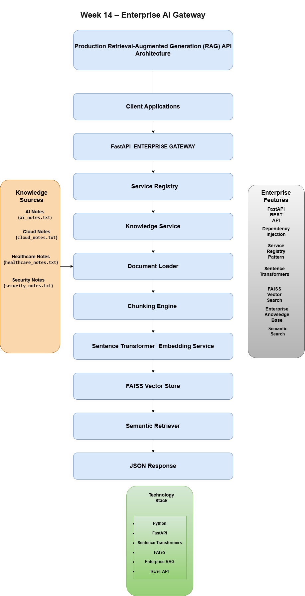
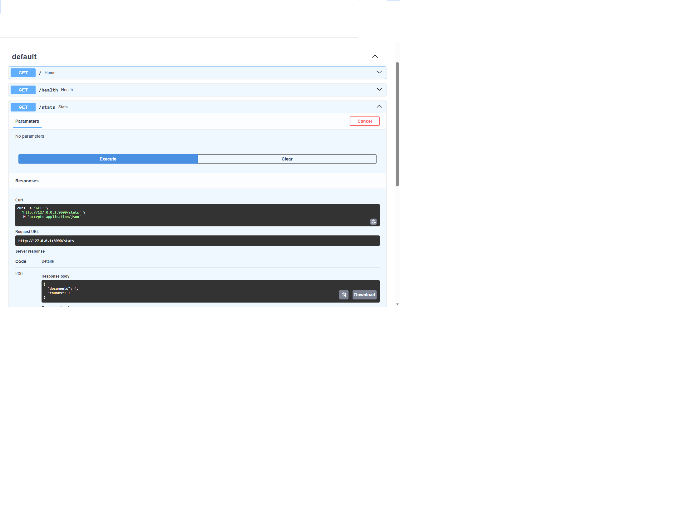
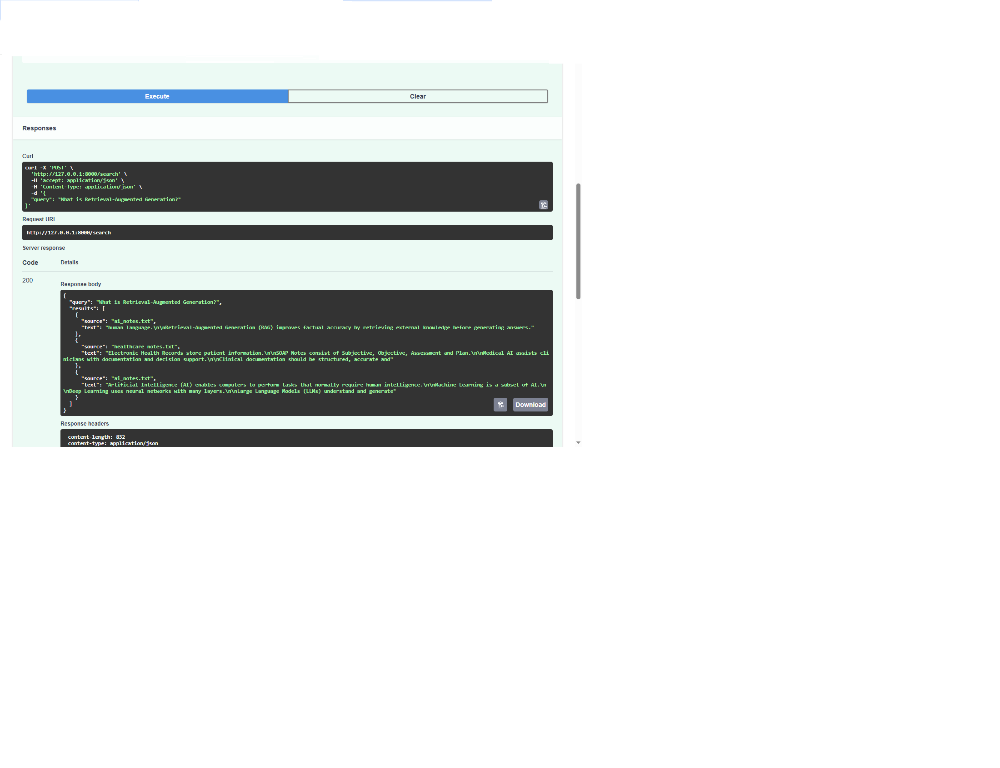
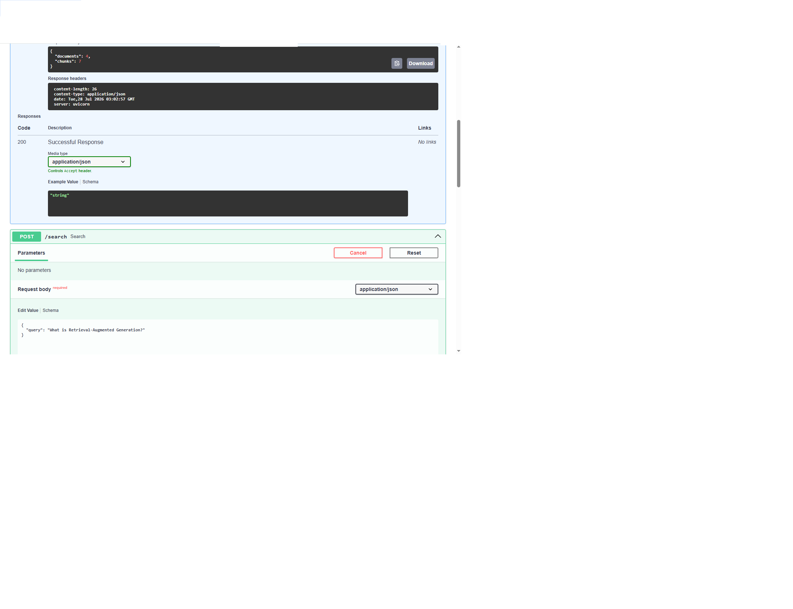
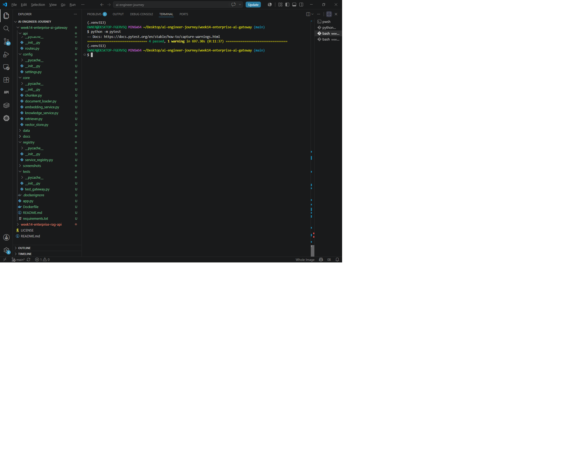

# Week 14 – Enterprise AI Gateway


> **Production Retrieval-Augmented Generation (RAG) API Gateway built with FastAPI, Sentence Transformers, FAISS Vector Search, and enterprise software architecture.**

---

# Project Overview

Week 14 transforms the Retrieval-Augmented Generation (RAG) platform built in previous weeks into a **production-style Enterprise AI Gateway**.

Rather than exposing internal AI components directly, the system introduces an enterprise API layer responsible for routing requests, coordinating services, and returning structured JSON responses.

The project demonstrates software engineering practices used in enterprise AI systems, including modular architecture, dependency separation, semantic retrieval, automated testing, and technical documentation.

---

# Architecture

The system architecture was professionally designed using **draw.io (diagrams.net)** following enterprise software architecture documentation standards.

### Architecture Diagram



### Architecture Documentation

```
docs/week14-enterprise-ai-gateway-architecture.md
```

### Editable Source

```
docs/week14-enterprise-ai-gateway-architecture.drawio
```

---

# Features

- Enterprise FastAPI Gateway
- REST API Endpoints
- Modular Service Architecture
- Service Registry Pattern
- Enterprise Knowledge Service
- Document Loader
- Chunking Engine
- Sentence Transformer Embeddings
- FAISS Vector Search
- Semantic Search
- JSON API Responses
- Automated Testing
- Professional Architecture Documentation

---

# Project Structure

```text
week14-enterprise-ai-gateway/

├── api/
├── config/
├── core/
├── data/
├── docs/
├── registry/
├── screenshots/
├── tests/
├── app.py
├── requirements.txt
└── README.md
```

---

# API Endpoints

## Home

```
GET /
```

Returns gateway information.

---

## Health

```
GET /health
```

Returns application health status.

---

## Statistics

```
GET /stats
```

Example response

```json
{
  "documents": 4,
  "chunks": 7
}
```

---

## Semantic Search

```
POST /search
```

Example request

```json
{
  "query": "What is Retrieval-Augmented Generation?"
}
```

Example response

```json
{
  "query": "What is Retrieval-Augmented Generation?",
  "results": [
    {
      "source": "ai_notes.txt",
      "text": "Retrieval-Augmented Generation (RAG) improves factual accuracy by retrieving external knowledge before generating answers."
    }
  ]
}
```

---

# Screenshots

## Enterprise AI Gateway Running



---

## Semantic Search



---

## Enterprise Statistics Endpoint



---

## Automated Tests Passing



---

## Enterprise Architecture Diagram


---

# Testing

Run the automated tests

```bash
python -m pytest
```

Latest result

```text
==========================
4 passed
==========================
```

---

# Technology Stack

- Python 3.13
- FastAPI
- Sentence Transformers
- FAISS
- Enterprise Retrieval-Augmented Generation (RAG)
- REST APIs
- Dependency Injection
- draw.io Architecture Documentation
- Pytest

---

# Skills Demonstrated

- Enterprise AI Architecture
- FastAPI API Development
- REST API Design
- Enterprise Service Registry
- Retrieval-Augmented Generation (RAG)
- Semantic Search
- Sentence Transformers
- Vector Databases (FAISS)
- Software Architecture Documentation
- Automated Testing
- AI Infrastructure Engineering

---

# Engineering Notes

This project follows enterprise engineering practices by emphasizing:

- Clean modular architecture
- Separation of concerns
- Reusable services
- Enterprise documentation
- Automated testing
- Technical diagrams maintained in draw.io
- Recruiter-ready project organization

The project also reflects healthy engineering practices by maintaining a clean development environment through regular cleanup of unused Docker images and containers, reducing local resource consumption and keeping the workspace production-oriented.

---

# Recruiter Notes

This repository demonstrates production-oriented AI engineering rather than tutorial-based development.

It showcases practical experience in:

- Enterprise API design
- Retrieval-Augmented Generation
- Semantic search systems
- Modular software architecture
- AI infrastructure
- Technical documentation
- Professional testing workflow

These practices align closely with engineering environments used by organizations such as Microsoft, AWS, OpenAI, Anthropic, Accenture, Discovery, Standard Bank, IBM, Deloitte, and similar enterprise AI teams.

---

# Status

## ✅ Portfolio Milestone Completed

Week 14 successfully demonstrates the transition from a standalone Retrieval-Augmented Generation system into a production-style Enterprise AI Gateway.

This project forms part of the structured **AI Engineer Journey Portfolio** and serves as another building block toward the long-term vision of developing enterprise-grade AI platforms such as **MedNavi AI**.