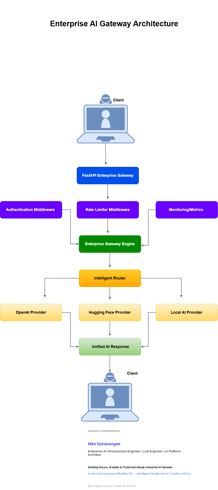

# Week 20 – Enterprise AI Gateway


---

# Enterprise AI Gateway

## Portfolio Project

This project demonstrates the design and implementation of an **Enterprise AI Gateway** capable of securely routing requests to multiple AI providers through a unified, production-inspired interface.

Rather than allowing applications to communicate directly with different AI providers, the gateway centralizes authentication, authorization, rate limiting, monitoring, provider routing, and standardized responses.

The architecture mirrors modern enterprise AI gateway patterns used in cloud-native AI platforms.

---

# Why this project matters

Enterprise AI systems require far more than calling an LLM API.

Organizations need:

- Centralized AI access
- Authentication
- Authorization
- API Gateway
- Rate Limiting
- Monitoring
- Provider abstraction
- Secure request routing
- Standardized responses

This project demonstrates those principles through a simplified enterprise architecture.

---

# Enterprise Features

- Enterprise AI Gateway
- Multi-Provider Routing
- Authentication Middleware
- Authorization Middleware
- API Key Security
- Request Validation
- Intelligent Request Router
- Rate Limiting
- Metrics Endpoint
- Enterprise Logging
- Unified AI Responses
- Docker-ready Deployment

---

# Enterprise Architecture



The gateway centralizes AI access through a secure middleware pipeline before routing requests to the appropriate provider.

For full documentation see:

```
docs/architecture.md
```

---

# Gateway Workflow

```
Client

↓

Authentication

↓

Authorization

↓

Rate Limiter

↓

Gateway Engine

↓

Intelligent Router

↓

AI Provider

↓

Unified Response

↓

Client
```

---

# REST API

| Method | Endpoint | Description |
|---------|----------|-------------|
| GET | / | Platform information |
| GET | /health | Health monitoring |
| GET | /providers | Available AI providers |
| GET | /models | Available models |
| POST | /generate | AI generation endpoint |
| GET | /metrics | Platform metrics |

---

# Enterprise Security

The gateway currently demonstrates:

- API-key authentication
- Authentication middleware
- Authorization middleware
- Request validation
- Rate limiting
- Secure routing

Future enterprise enhancements include:

- OAuth2
- JWT
- RBAC
- Identity Federation
- Audit Logging

---

# Multi-Provider Architecture

The gateway currently supports:

- OpenAI
- Hugging Face
- Local AI

The provider abstraction layer allows additional providers to be added without changing client applications.

Potential future providers:

- Azure OpenAI
- Anthropic Claude
- Google Gemini
- AWS Bedrock
- Mistral
- DeepSeek

---

# Testing

Enterprise validation includes:

- API Health
- Provider Discovery
- Model Discovery
- Request Routing
- Authentication
- Metrics

```
python -m pytest -v

6 passed
```

---

# Project Structure

```
week20-enterprise-ai-gateway/

app.py

Dockerfile

docker-compose.yml

requirements.txt

requirements_dev.txt

auth/

core/

gateway/

middleware/

models/

security/

tests/

docs/

README.md
```

---

# Screenshots

```
docs/screenshots/

01-swagger-home.png
02-health-endpoint.png
03-providers-endpoint.png
04-models-endpoint.png
05-authenticated-request.png
06-invalid-api-key.png
07-rate-limit-demo.png
08-metrics-endpoint.png
09-terminal-logging.png
10-authorize-button.png
11-tests-passing.png
12-architecture.png
```

---

# Docker Deployment

The project includes:

- Dockerfile
- docker-compose.yml

Deployment targets include:

- Docker
- Kubernetes
- Azure Container Apps
- AWS ECS
- Google Cloud Run

---

# Skills Demonstrated

### Enterprise AI Engineering

- AI Gateway Design
- Provider Abstraction
- Enterprise Middleware
- AI Routing
- Enterprise Security

### Backend Engineering

- FastAPI
- REST APIs
- Dependency Injection
- Modular Architecture
- Service Layers

### Security Engineering

- Authentication
- Authorization
- API Keys
- Rate Limiting

### DevOps

- Docker
- Containerization
- Deployment Readiness
- Automated Testing

---

# Real-World Applications

The architecture demonstrated here can evolve into:

- Enterprise AI Platforms
- AI Agent Platforms
- LLM Infrastructure
- Multi-Agent Systems
- Healthcare AI Platforms
- Secure Enterprise APIs
- MedNavi AI

---

# Relationship to MedNavi AI

The Enterprise AI Gateway forms the communication backbone for MedNavi AI.

Future MedNavi services—including multilingual transcription, SOAP generation, Retrieval-Augmented Generation (RAG), intelligent triage, appointment scheduling, pharmacy integration, and clinical AI assistants—can all communicate securely through this gateway.

By separating infrastructure from application logic, MedNavi AI gains:

- Scalability
- Provider independence
- Stronger security
- Easier maintenance
- Cloud-native deployment readiness

---

# Author

**Mike Nzirainengwe**

Enterprise AI Infrastructure Engineer  
LLM Engineer  
AI Platform Architect

Building Secure, Scalable & Production-Ready Enterprise AI Systems

**Long-Term Vision**

**MedNavi AI — Intelligent Healthcare Platform for Southern Africa**

---

# AI Engineer Journey

Week 20 concludes the structured AI Engineering Portfolio Journey.

Enterprise projects completed include:

- Week 17 – Enterprise MCP Server
- Week 18 – Enterprise Authentication Platform
- Week 19 – Enterprise Identity & Access Management Platform
- Week 20 – Enterprise AI Gateway

This portfolio demonstrates practical implementation of enterprise AI architecture, secure backend engineering, cloud-ready deployment, and production-inspired AI infrastructure.

---

© 2026 Mike Nzirainengwe