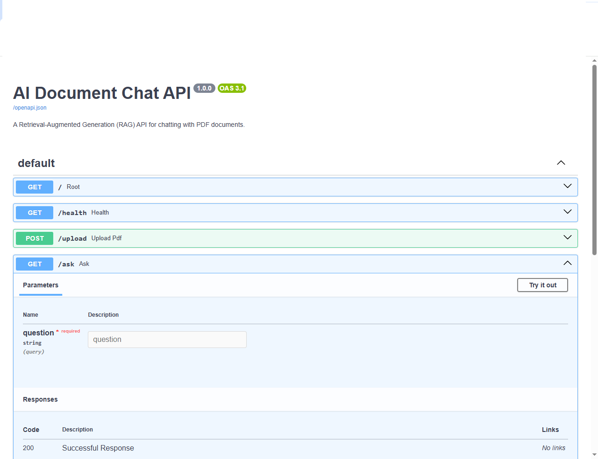

# 📚 Week 3 – AI Document Chat (RAG)

A production-style Retrieval-Augmented Generation (RAG) application built with FastAPI, FAISS, SentenceTransformers, and Hugging Face Transformers. Users can upload PDF documents and ask natural language questions grounded only in the uploaded knowledge base.

---

## 📸 Demo

### Swagger API


The project exposes a REST API built with FastAPI. Interactive API documentation is available through Swagger UI.

---

### Upload PDF


Users can upload one or more PDF documents, which are automatically processed into searchable chunks and indexed using FAISS.

---

### Ask Questions



Questions are answered using Retrieval-Augmented Generation (RAG). The application retrieves the most relevant document chunks before generating a grounded response using Google FLAN-T5.

## 🚀 Features

- Upload PDF documents
- Extract text from PDFs
- Split documents into searchable chunks
- Generate vector embeddings
- Store embeddings in a vector database
- Retrieve relevant information using semantic search
- Answer user questions using an LLM
- REST API built with FastAPI
- Interactive Swagger documentation
- Docker support
- Unit testing with pytest

---

## 🛠️ Technologies

- Python 3.13
- FastAPI
- LangChain
- FAISS Vector Database
- Sentence Transformers
- Hugging Face Transformers
- PyPDF
- Docker
- Pytest

---

## 📂 Project Structure

```
week3-rag-chatbot/
│
├── app.py
├── rag.py
├── requirements.txt
├── README.md
├── test_rag.py
│
├── data/
├── documents/
└── vectorstore/
```

---

## 🎯 Learning Objectives

This project demonstrates:

- Retrieval-Augmented Generation (RAG)
- Embeddings
- Semantic Search
- Vector Databases
- Document Processing
- FastAPI APIs
- Docker
- AI Engineering Best Practices

---

## 📈 Roadmap

- [x] Build project structure
- [x] Create professional README
- [x] Configure requirements
- [x] Build FastAPI application
- [x] Build initial RAG engine
- [x] Connect API to RAG engine
- [x] Test API endpoints
- [ ] Upload PDF
- [ ] Extract document text
- [ ] Chunk documents
- [ ] Generate embeddings
- [ ] Store vectors
- [ ] Semantic search
- [ ] AI question answering
- [ ] Dockerize application
- [ ] Deploy to the cloud

---

Developed by **Mike Nzirainengwe**