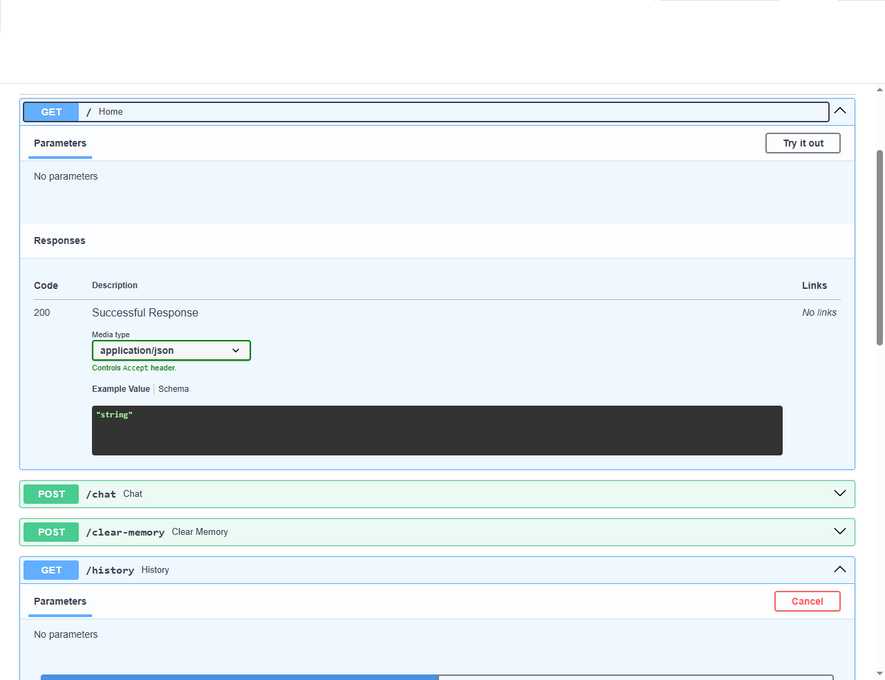
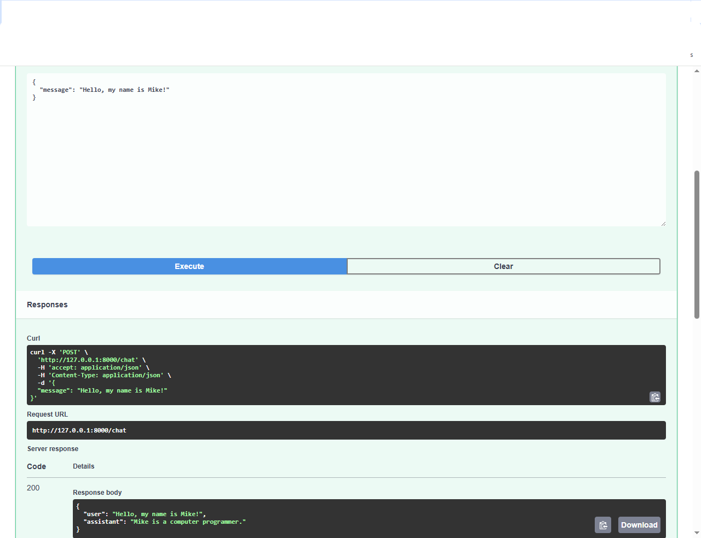
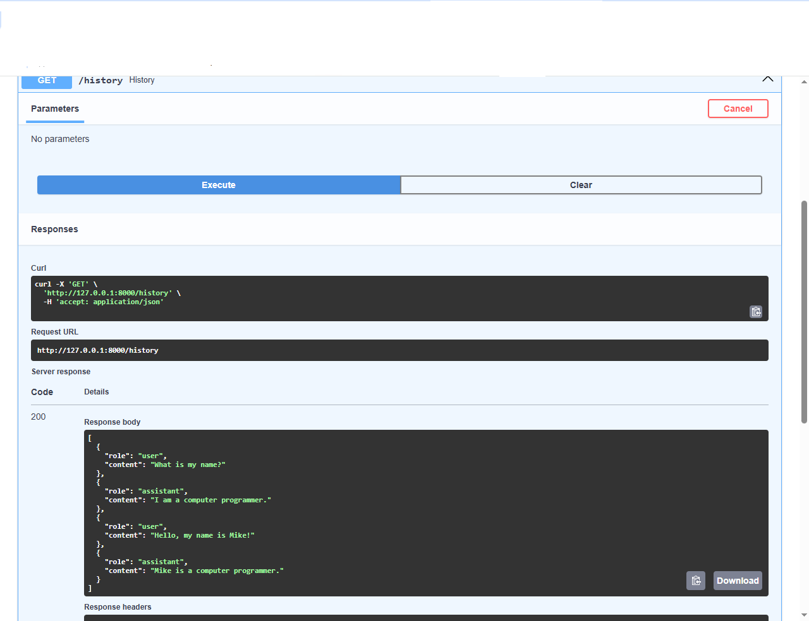

# 💬 Week 4 – Conversational AI with Memory

A production-ready conversational AI application built with **FastAPI**, **Hugging Face Transformers**, and **Conversation Memory**.

Unlike a simple chatbot, this application maintains conversation history, allowing it to answer follow-up questions using previous interactions.

---

# 🚀 Features

- Multi-turn conversations
- Conversation memory
- Prompt engineering
- FastAPI REST API
- Interactive Swagger documentation
- Memory management
- Conversation history endpoint
- Clear memory endpoint
- Modular architecture
- Production-ready project structure

---

# 🛠 Technologies

- Python 3.13
- FastAPI
- Hugging Face Transformers
- FLAN-T5
- Pydantic
- PyTorch
- Swagger UI
- Git
- GitHub

---

# 📂 Project Structure

```text
week4-conversational-ai/

│
├── app.py
├── chat.py
├── llm.py
├── memory.py
├── prompt_template.py
├── requirements.txt
├── README.md
│
├── screenshots/
├── architecture/
└── tests/
```

---

# 🧠 Architecture

```
User
 │
 ▼
FastAPI
 │
 ▼
Chat Engine
 │
 ├────────► Conversation Memory
 │
 ▼
Prompt Builder
 │
 ▼
Hugging Face LLM
 │
 ▼
AI Response
 │
 ▼
Memory Update
```

---

# 📸 Demo

## Swagger API



---

## Chat Endpoint



---

## Conversation History



---

# 📚 API Endpoints

| Method | Endpoint | Description |
|---------|----------|-------------|
| GET | / | API Status |
| POST | /chat | Chat with the AI |
| GET | /history | Retrieve conversation history |
| POST | /clear-memory | Clear conversation memory |

---

# 🎯 Learning Objectives

This project demonstrates:

- Conversation Memory
- Stateful AI Applications
- Prompt Engineering
- FastAPI APIs
- LLM Integration
- Modular Software Design

---

# 📚 Professional Development Roadmap

## ✅ Completed

- Python for AI Engineering
- FastAPI REST APIs
- Prompt Engineering
- Hugging Face Transformers
- Sentence Transformers
- Retrieval-Augmented Generation (RAG)
- FAISS Vector Search
- PDF Processing
- Semantic Search
- Conversation Memory
- Git & GitHub

## 🚧 Currently Building

- Conversational AI
- AI Agents
- LangGraph
- LlamaIndex
- ChromaDB & Pinecone
- Kubernetes for AI Deployment
- Azure AI Services
- AWS AI Services
- MLOps for LLM Applications

---

Developed by **Mike Nzirainengwe**