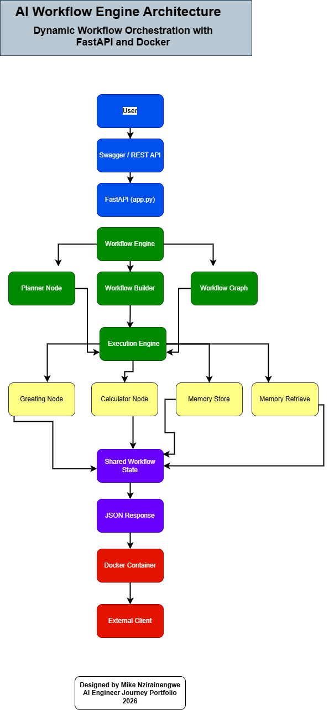
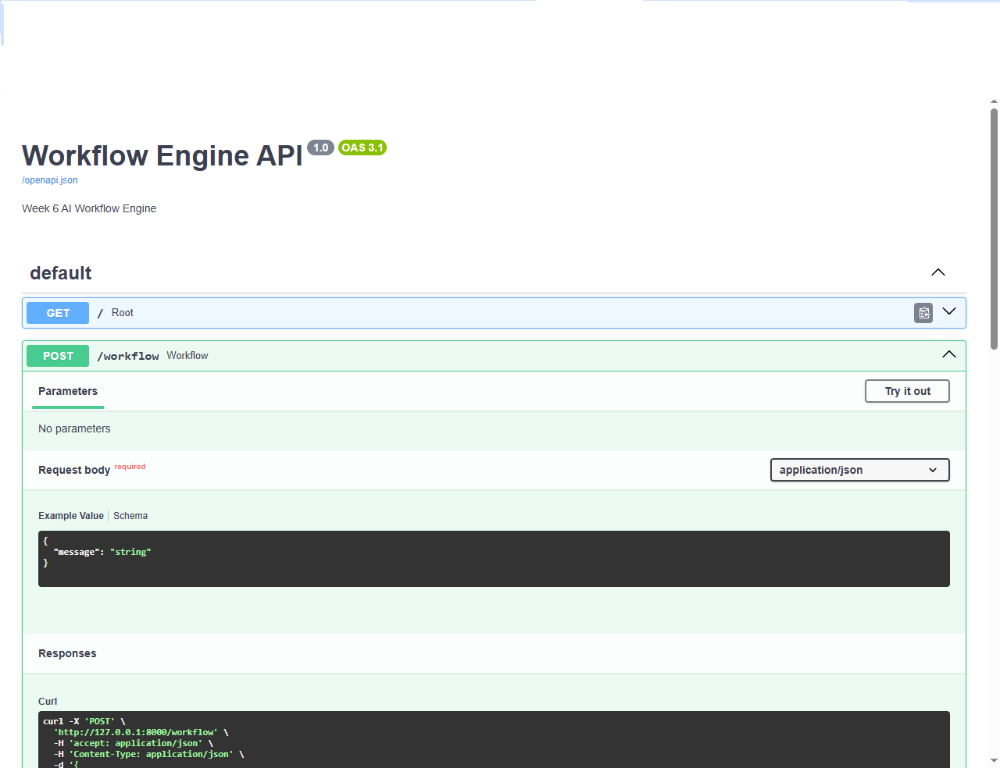
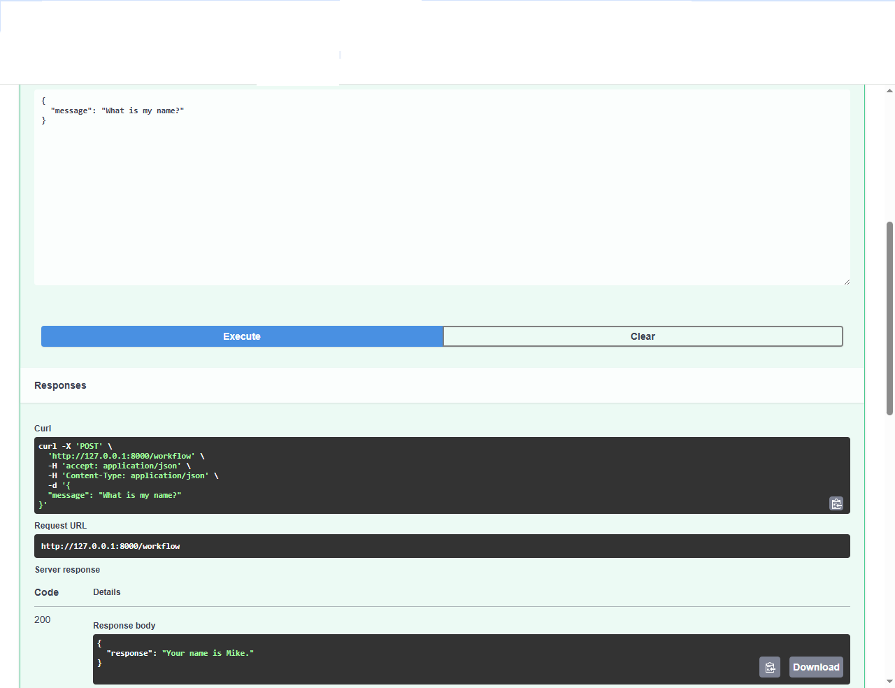
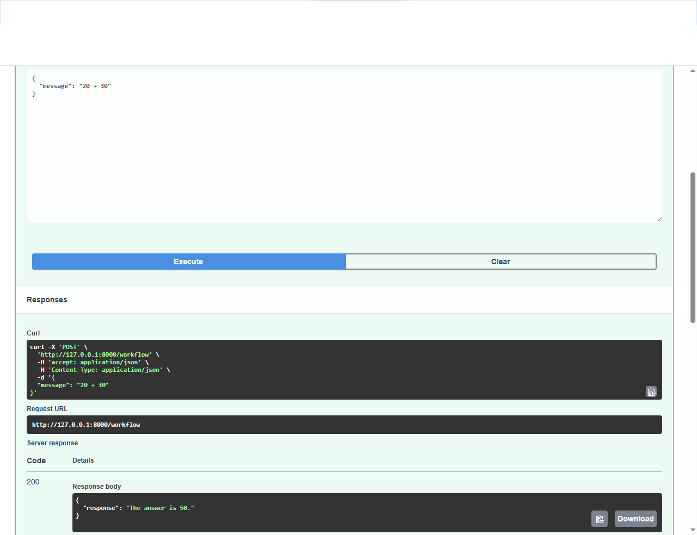
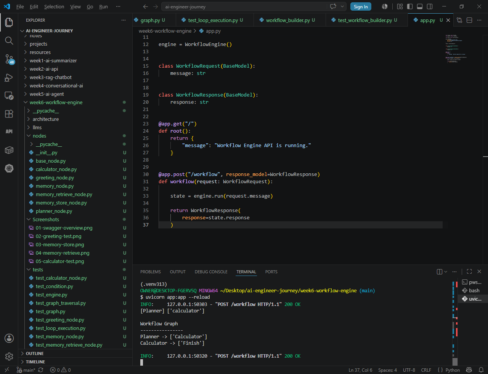
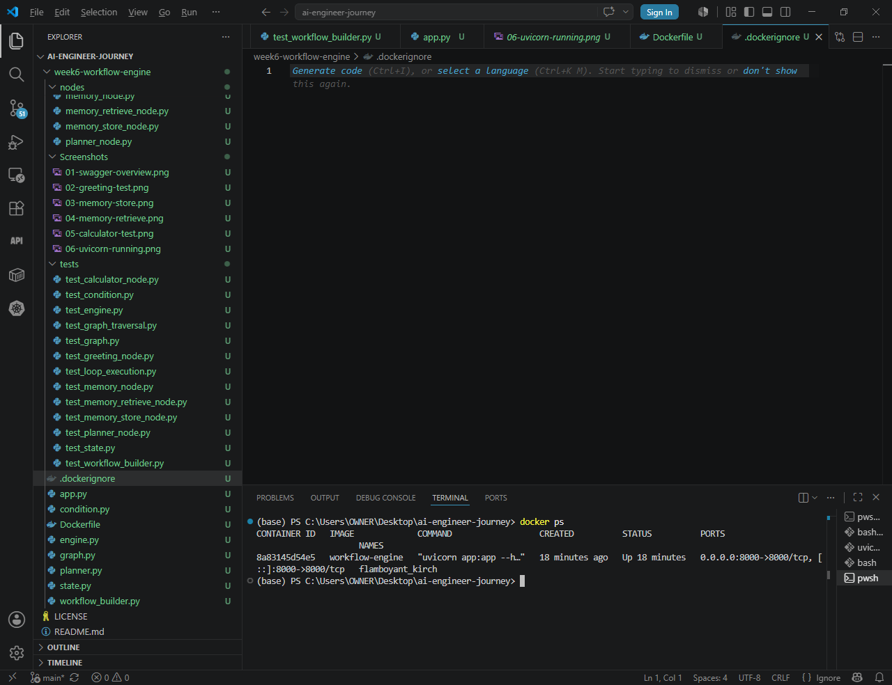

# Week 6 – AI Workflow Engine


> Dynamic AI Workflow Orchestration with FastAPI and Docker

---

## Overview

This project demonstrates the design and implementation of a lightweight AI Workflow Engine built entirely in Python.

The engine dynamically routes user requests to specialized workflow nodes using a planner and execution engine while maintaining shared workflow state.

The project also exposes the engine through a FastAPI REST API and packages the entire application inside a Docker container.

This project forms part of my AI Engineer Journey toward becoming a world-class LLM Engineer, AI Infrastructure Engineer, and AI Architect.

---

# Architecture

The complete system architecture is available below.



---

# Features

- Workflow State Management
- Dynamic Workflow Planning
- Workflow Graph
- Graph Traversal
- Execution Engine
- Greeting Node
- Calculator Node
- Memory Store Node
- Memory Retrieve Node
- FastAPI REST API
- Docker Containerization

---

# Project Structure

```text
week6-workflow-engine/

├── architecture/
│   ├── week6-workflow-engine.drawio
│   └── week6-workflow-engine-architecture.png
│
├── nodes/
│   ├── base_node.py
│   ├── planner_node.py
│   ├── greeting_node.py
│   ├── calculator_node.py
│   ├── memory_store_node.py
│   └── memory_retrieve_node.py
│
├── tests/
│
├── Dockerfile
├── .dockerignore
├── engine.py
├── graph.py
├── state.py
├── condition.py
└── app.py
```

---

# Workflow

```
User

↓

FastAPI

↓

Workflow Engine

↓

Planner

↓

Workflow Builder

↓

Execution Engine

↓

Workflow Nodes

↓

Workflow State

↓

JSON Response
```

---

# API Endpoints

## POST /workflow

Example Request

```json
{
    "message": "What is my name?"
}
```

Example Response

```json
{
    "response": "Your name is Mike."
}
```

---

# Docker

Build

```bash
docker build -t workflow-engine .
```

Run

```bash
docker run -p 8000:8000 workflow-engine
```

Swagger

```
http://127.0.0.1:8000/docs
```

---

# Screenshots

## Swagger Overview



---

## Greeting


---

## Memory Store


---

## Memory Retrieve



---

## Calculator



---

## Uvicorn Running



---

## Docker Running



---

## Swagger Running Inside Docker


---

# Technologies

- Python
- FastAPI
- Uvicorn
- Docker
- Git
- GitHub

---

# Learning Objectives

This project demonstrates understanding of:

- AI Workflow Design
- Dynamic Workflow Planning
- Graph Traversal
- Shared Workflow State
- REST API Development
- Docker Containerization
- Software Architecture

---

# Future Improvements

- Multi-Agent Workflows
- LangGraph Integration
- CrewAI Integration
- LLM Routing
- Persistent Memory
- Tool Calling
- Kubernetes Deployment

---

# Author

Mike Nzirainengwe

AI Engineer Journey Portfolio

2026