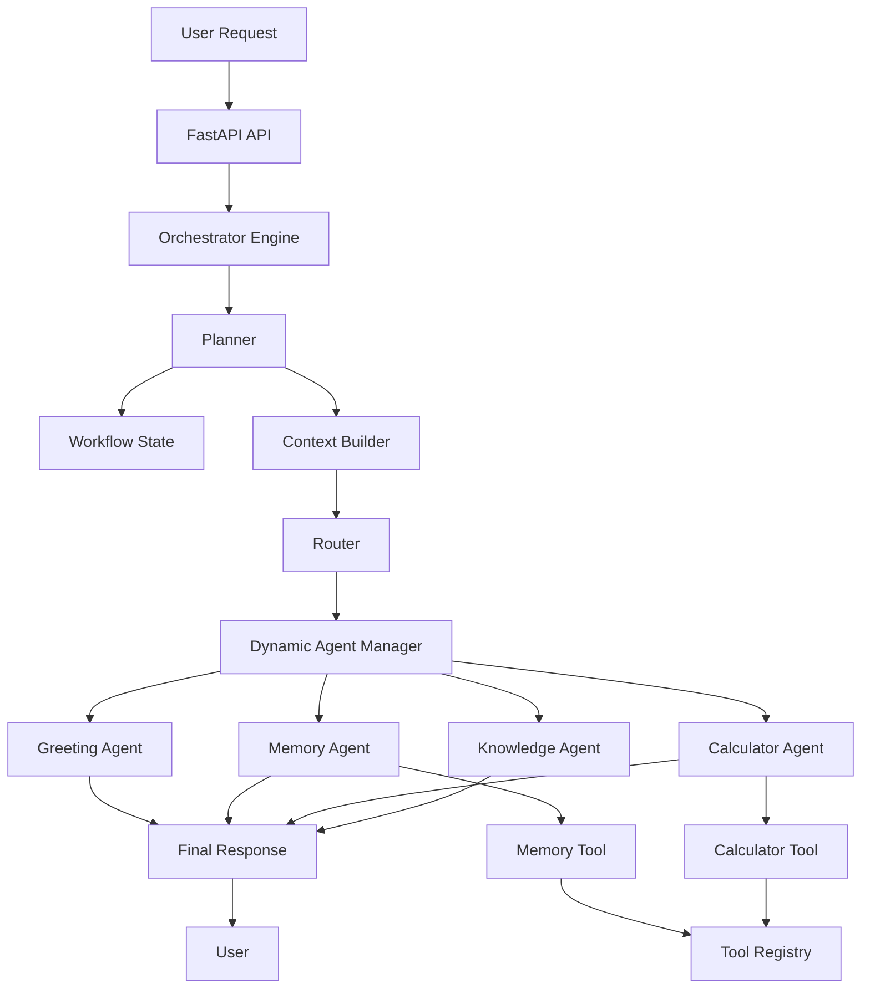

# Week 7 — Multi-Agent Orchestrator Architecture

```mermaid
flowchart TD

    A[User Request]

    A --> B[FastAPI API]

    B --> C[Orchestrator Engine]

    C --> D[Planner]

    D --> E[Workflow State]

    D --> F[Context Builder]

    F --> G[Router]

    G --> H[Dynamic Agent Manager]

    H --> I[Greeting Agent]
    H --> J[Memory Agent]
    H --> K[Calculator Agent]
    H --> L[Knowledge Agent]

    J --> M[Memory Tool]
    K --> N[Calculator Tool]

    M --> O[Tool Registry]
    N --> O

    I --> P[Final Response]
    J --> P
    K --> P
    L --> P

    P --> Q[User]
```