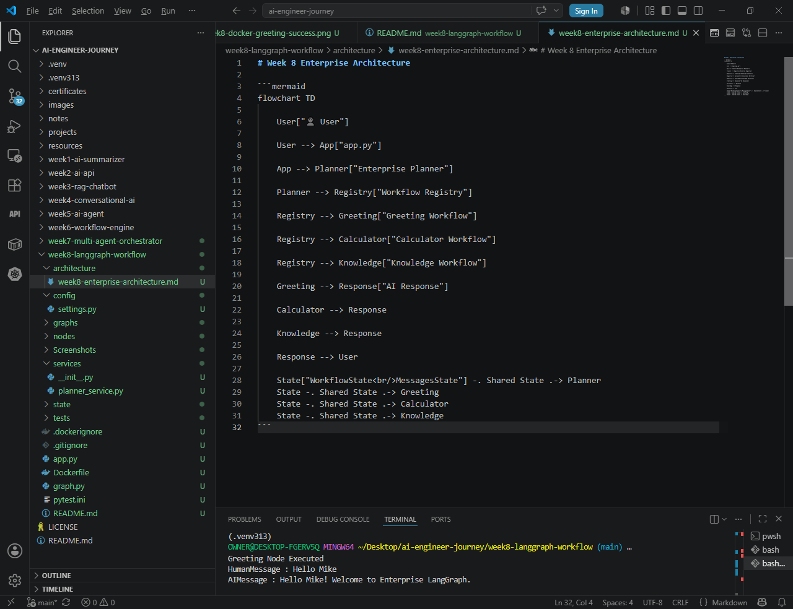
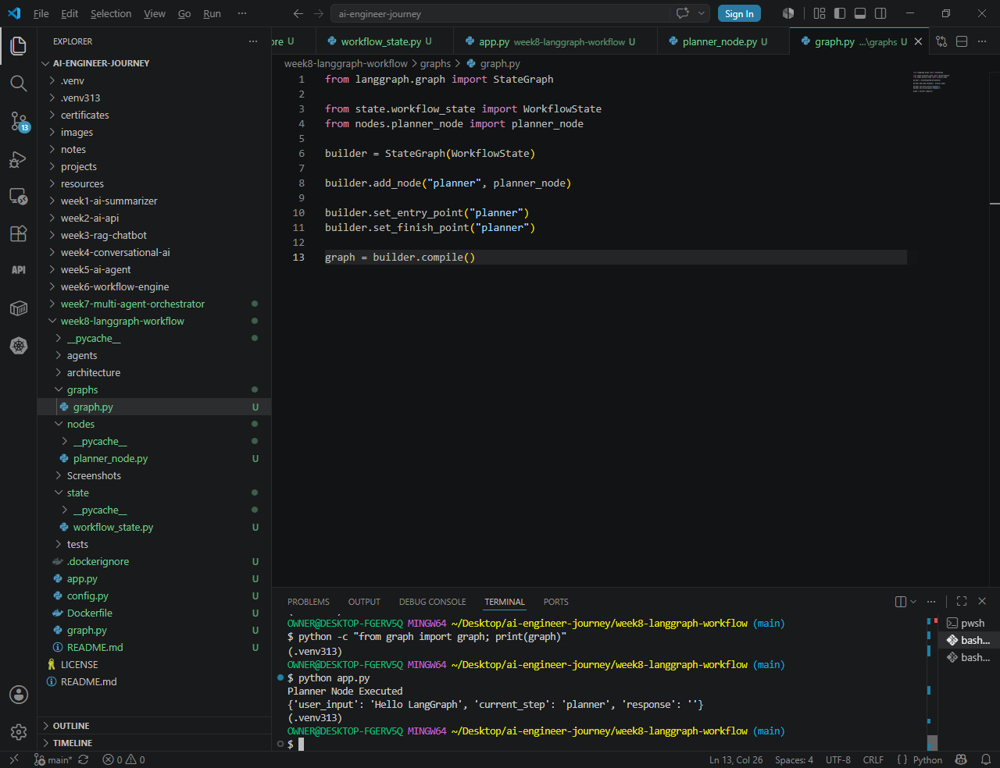
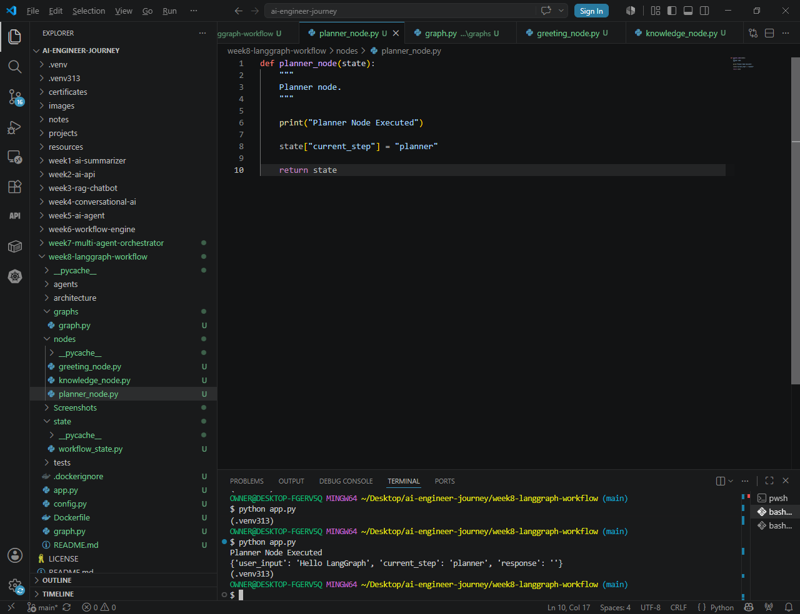
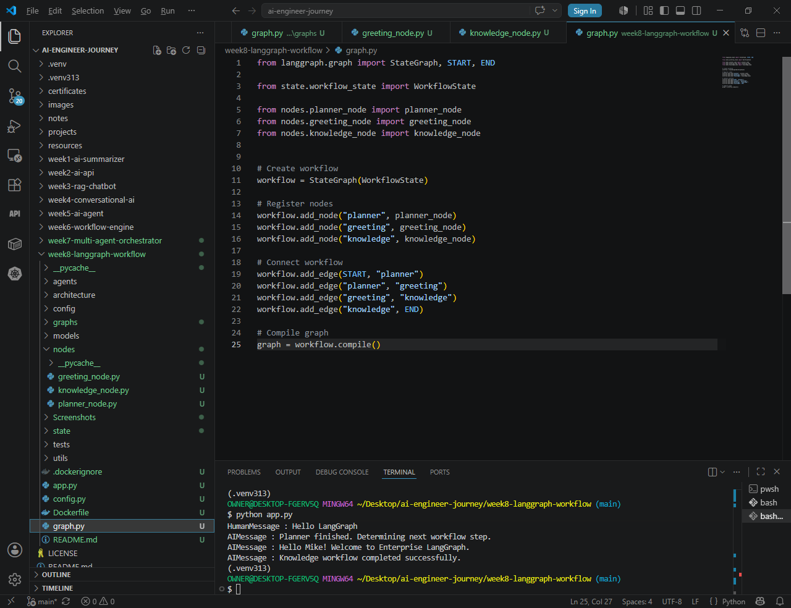
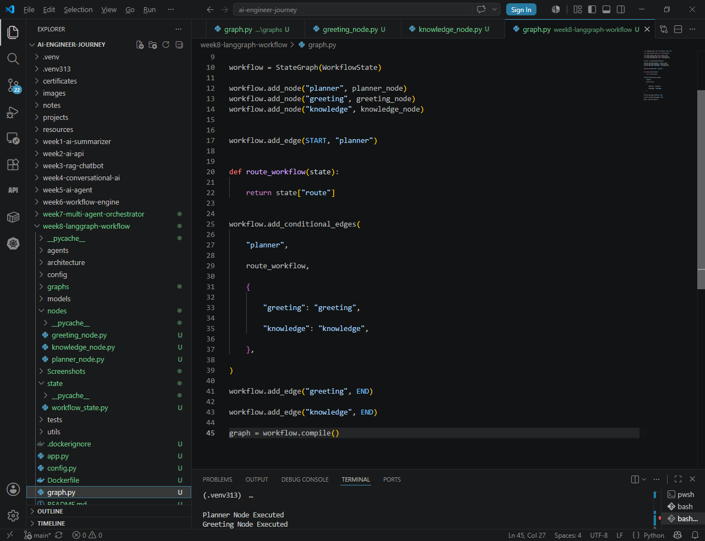
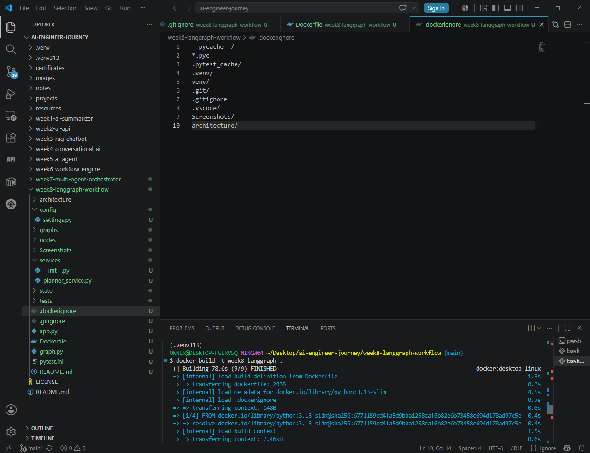
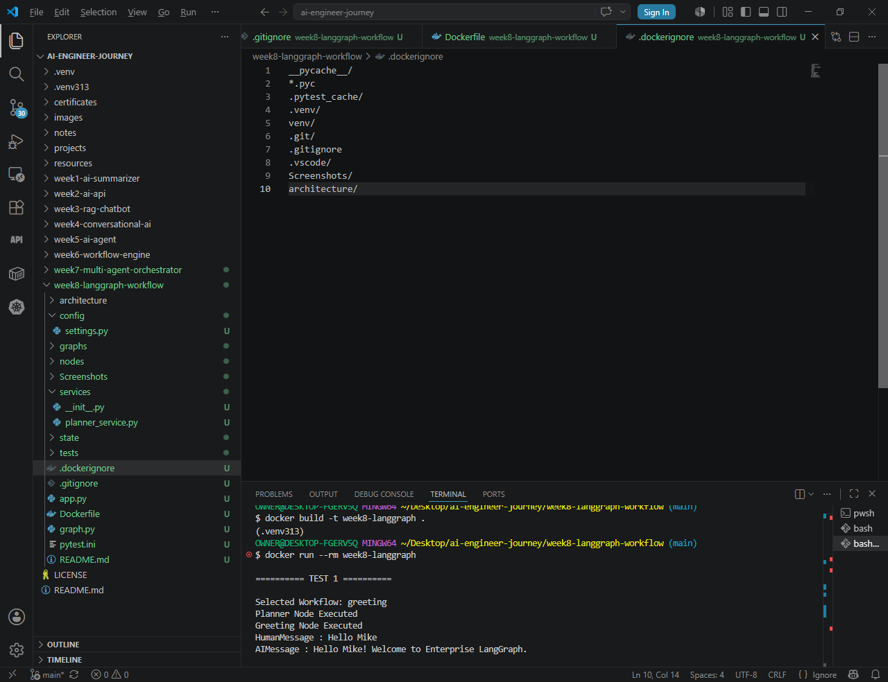

# Week 8 – Enterprise LangGraph Workflow


> Building Enterprise AI Workflows using LangGraph 1.x

---

# Overview

This project demonstrates how to build an enterprise-ready AI workflow using **LangGraph 1.x**.

Rather than implementing a single monolithic workflow, the project introduces architectural components commonly used in production AI systems:

- Enterprise Planner
- Workflow Registry
- Specialized Workflow Graphs
- LangGraph State Management
- Containerization with Docker
- Unit Testing using Pytest

The objective is to learn workflow orchestration while designing software that resembles real enterprise AI platforms.

---

# Technologies Used

- Python 3.13
- LangGraph 1.x
- LangChain Core
- Pytest
- Docker
- Git
- VS Code

---

# Development Timeline

- ✅ Enterprise workflow architecture
- ✅ Planner service
- ✅ Workflow registry
- ✅ Multi-node execution
- ✅ Conditional routing
- ✅ Docker containerization
- ✅ Automated testing
- ✅ Architecture documentation

---

# Project Structure

```text
week8-langgraph-workflow/

├── app.py
├── graph.py
├── Dockerfile
├── .dockerignore
├── pytest.ini
├── .gitignore
├── README.md

├── architecture/
├── config/
├── graphs/
├── nodes/
├── Screenshots/
├── services/
├── state/
└── tests/
```

---

# Enterprise Architecture

The following diagram illustrates the enterprise workflow introduced in Week 8.



---

# Enterprise Workflow

```text
                 User

                   │

                   ▼

          Enterprise Planner

                   │

                   ▼

           Workflow Registry

      ┌──────────┼──────────┐

      ▼          ▼          ▼

 Greeting   Calculator   Knowledge

 Workflow    Workflow    Workflow

      ▼          ▼          ▼

          AI Response
```

---

# Features

- Enterprise Planner Service
- Workflow Registry
- LangGraph MessagesState
- Greeting Workflow
- Knowledge Workflow
- Calculator Workflow (prototype)
- Docker Support
- Unit Tests
- Enterprise Project Structure

---

# Unit Testing

Planner classification is verified using Pytest.

Current tests:

- Greeting classification
- Calculator classification
- Knowledge classification

Result:

✅ **3 Tests Passed**

---

# Docker Support

The project includes:

- Dockerfile
- .dockerignore

The application builds successfully inside Docker and executes the workflow.

---

# Screenshots

## 1. First LangGraph Workflow

Demonstrates the first successful LangGraph workflow.



---

## 2. Multi-Node Workflow

Shows the evolution from a single-node workflow to multiple nodes.



---

## 3. Enterprise Workflow

Enterprise LangGraph workflow implementation.


---

## 4. Enterprise Workflow Code

Core implementation of the enterprise workflow.



---

## 5. Conditional Routing

Planner successfully selects the correct workflow.


---

## 6. Conditional Routing Code

Implementation of the routing logic.



---

## 7. Docker Build

Successful Docker image build.



---

## 8. Docker Execution

Application successfully running inside Docker.



---

## 9. Enterprise Architecture

Final enterprise architecture.


---

# Engineering Decision

During development, LangGraph conditional routing exposed a framework-specific branch resolution issue when routing calculator requests inside a single monolithic graph.

Rather than tightly coupling workflow routing inside LangGraph, the project was intentionally redesigned toward an enterprise architecture using:

- Enterprise Planner
- Workflow Registry
- Specialized Workflow Graphs

This architecture more closely resembles production AI systems and becomes the foundation for the next phase of the AI Engineer Journey.

---

# Lessons Learned

- LangGraph workflow fundamentals
- MessagesState
- Enterprise workflow design
- Workflow separation
- Docker containerization
- Enterprise project organization
- Automated testing with Pytest

---

# Next Steps

Week 9 introduces:

- Enterprise Multi-Workflow Platform
- Independent workflow graphs
- Dynamic workflow selection
- Workflow orchestration
- Scalable AI platform architecture

---

# Author

**Mike Nzirainengwe**

AI Engineer Journey

Building towards becoming:

- World-class LLM Engineer
- AI Infrastructure Engineer
- AI Architect
- Founder of MedNavi AI