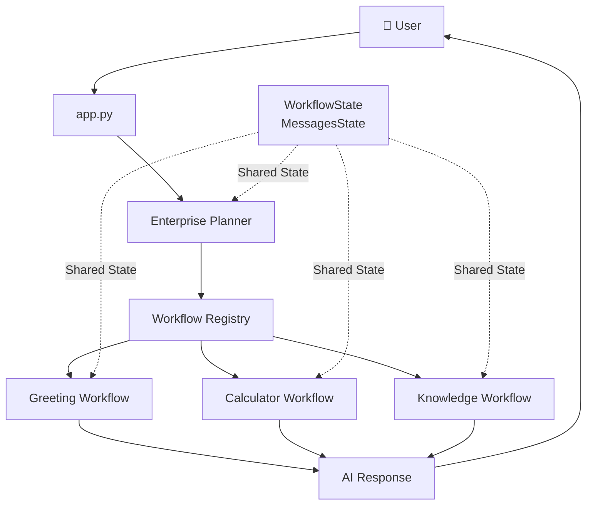

# Week 8 Enterprise Architecture

```mermaid
flowchart TD

    User["👤 User"]

    User --> App["app.py"]

    App --> Planner["Enterprise Planner"]

    Planner --> Registry["Workflow Registry"]

    Registry --> Greeting["Greeting Workflow"]

    Registry --> Calculator["Calculator Workflow"]

    Registry --> Knowledge["Knowledge Workflow"]

    Greeting --> Response["AI Response"]

    Calculator --> Response

    Knowledge --> Response

    Response --> User

    State["WorkflowState<br/>MessagesState"] -. Shared State .-> Planner
    State -. Shared State .-> Greeting
    State -. Shared State .-> Calculator
    State -. Shared State .-> Knowledge
```